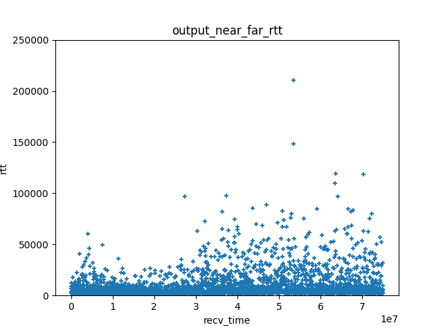

# Christian's Congestion Control Code - C4

The C4 project look at defining a new Congestion Control algorithm suitable for
use in QUIC, with the following priorities:

- Works well with video and other real time applications, which implies
  good support for “application limited” flows,
  keeping the throughput stable, avoid buffer-bloat, and generally
  driving for low delays.
- Work well with common access networks, including questionable Wi-Fi networks.
- Keep it simple

Out of those three priorities, the support for "questionable" Wi-Fi had a major
influence on the design. We got reports of video not working well in some Wi-Fi
networks, notably networks in office buildings shared by multiple tenants and
appartment buildings. Analyzing traces showed that these networks could exhibit
very large delay jitter, as seen in the following graph:

In presence of such jitter, we see transmission sometimes stalling if the
congestion window is too small. To avoid that, we have to set the congestion
window to be at least as large as the product of the target data rate by
the maximum RTT. This leads to our design decision of tracking two main
state variables in C4: the "nominal data rate", which is very similar to
the "bottleneck bandwidth" of BBR (see
[BBR-draft](https://datatracker.ietf.org/doc/draft-ietf-ccwg-bbr/));
and the "nominal max RTT" which is set to the largest recently
experienced RTT as measured in the absence of congestion.

The support for application limited flows is achieved by keeping
the nominal data rate stable in periods of low application traffic, and
only reducing it when congestion is actually experienced. C4 keeps the
bandwidth stable by adopting a cautious bandwidth probing strategy,
so that in most cases probing does not cause applications to send
excess data and cause priority inversions.

C4 uses a "sensitivity" curve to obtain fairness between multiple
connections. The sensitivity curve computes sensitivity as function
of the nominal data rate, ensuring that flows sending at a high
data rate are more sensitive than flows using a lower
data rate, and thus reduce their data rate faster
in response to congestion signals. Our simulations shows that this
drives to fair sharing of a bottleneck between C4 flows, and
also ensure reasonable sharing when sharing the bottleneck
with Cubic or BBR flows.

We have published three IETF drafts to describe the
[C4 design](https://datatracker.ietf.org/doc/draft-huitema-ccwg-c4-design), 
[C4 algorithm specifications](https://datatracker.ietf.org/doc/draft-huitema-ccwg-c4-spec),
and the [testing of C4](https://datatracker.ietf.org/doc/draft-huitema-ccwg-c4-test). 

The first stage of the project was to prepare a series of papers discussing congestion
control design issues such as:

* how to quickly drive connection from a cold start to sending at network speed? Is
  Hystart ()? What about [Hystart++](https://www.ietf.org/rfc/rfc9406.html)? Maybe a
  helping of [Careful Resume]( https://datatracker.ietf.org/doc/draft-ietf-tsvwg-careful-resume/)?
  See the [start up discussion paper](./papers/Start-up_challenge.md).

* how to combine multiple signals like delays, ECN marks and packet losses to detect
  congestion? Should there be a differential behavior, such as slowing down faster if
  packet losses are detected than if delay increases? Does that affect the "recovery"
  mechanism introduced in TCP Reno? We propose a specific "most restrictive signal"
  rule in the paper on
  [Combining congestion signals](./papers/combine_congestion_signals.md).

* algorithms that try to minimize delay tend to be too polite. That's the main reason why
  [TCP Vegas](https://sites.cs.ucsb.edu/~almeroth/classes/F05.276/papers/vegas.pdf)
  can only be deployed in controlled environments. TCP Vegas notices delay increases
  before losses happen, backs off first, and eventually yields most of the network capacity to
  the competing connection using loss based algorithms like Reno or Cubic.
  A deployable algorithm will have to
  deal with that issue, maybe by adopting a polite delay minimizing attitude by default, but
  switching to a more aggressive posture when competing with Reno or Cubic. This is easier said
  than done. See the discussion paper on [vegas like competion issues](./papers/vegas_like_compete.md)

* fair sharing between connections requires that connections using
  lots of bandwidth back off faster than slower connections. But algorithms have to scale
  over order of magnitudes of bandwidth, from a few 100 kbps to 10 Gbps. Scaling requires that
  both increase and backoff be proportional to the current throughput, in which case
  we lose the fairness provided by the combination of linear increase and
  multiplicative decrease. What gives?

* If we accept to not guarantee fairness, we will need to at least guarantee that
  other connections do not "starve". How do we do that?

* In competitive scenarios, connections can only increase their share of bandwidth
  by forcing some other connections to yield. How do they do that? Are slow increases
  sufficient, or do we need "push" events with sizeable increase, maybe at least 25%?

* Real time connections are often application limited. For example, video transmission
  will alternate
  between periodic refresh that may require lots of bandwidth, and differential
  updates that require very little. Can that interact well with bandwidth seeking
  congestion control algorithms?

* delay based algorithms have to compare measurements with a reference "min RTT". A classic
  implementation is to consider the min RTT since the beginning of the connection, but
  that leads directly to the "late comer advantage" problem. Adjusting the reference
  RTT to current conditions leads to an opposite issue, in which the reference RTT slowly
  drifts up over time. BBR solves that with periodic resets, but these periodic resets
  degrade the performance of Real-Time applications. Is there a better way?

* what is the best way to take advantage of network support for low latency, such as
  the [dual queue mechanism of L4S](https://www.rfc-editor.org/rfc/rfc9332.html) or
  the isolation features of other Active Queue Management algorithms like
  [Flow Queue Codel](https://datatracker.ietf.org/doc/html/rfc8290),
  [PIE](https://datatracker.ietf.org/doc/rfc8033/) or
  [FQ-PIE](https://www.ietf.org/archive/id/draft-tahiliani-tsvwg-fq-pie-00.html)?

* how do we handle special conditions like the "suspension" of Wi-Fi networks, or
  the simultaneous variation of bandwidth and delays in "low Earth orbit" satellite
  networks?

We can test these scenarios using the simulation tools in the Picoquic test suite,
through the `pico_sim` tool. The tool will execute a simulation scenario, and
compute qlog traces for the connections in that scenario. The simulation
scenario is specified in a text file. Some examples of simulation scenarios are provided
in the `sim_specs` folder.

The qlog traces produced by the simulation scenarios can be visualized with the
Python script `qlogparse.py`, which produces a graphs showing how key parameters
like congestion window or RTT vary for the simulated connections.

Our first goal is to collect a robust set of simulation scenarios to investigate
our list of issues, and refine our series of documents. This may require some
updates to the simulation tool, for example to simulate various AQM policies,
or to incorporate the simulations of Wi-Fi links. 
