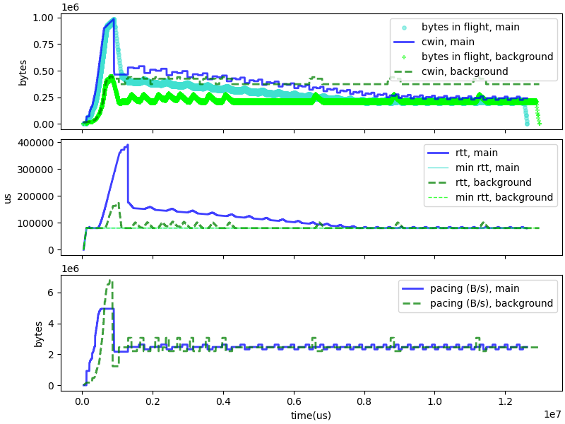

# C4 - Draining Queues

The rsults of tests in buffer bloat scenarios show C4 creating shorter queues than
Cubic but longer queues than BBR, even if we implement the "trimming 1/2" changes:

|  average RTT for buffer bloat tests| c4 | bbr | cubic | trimming 1/2 |
| --------- | ---:| ---:| ---:| ---:|
| bbloat |  113475 | 84750 | 229647 | 111173 |
| bbloat_c4 |  229418 | 92740 | 660442 | 234925 |
| bbloat_bbr |  131826 | 124558 | 266277 | 131812 |
| bbloat_cubic |  551053 | 97505 | 647602 | 551157 |

We first try to understand why by plotting the evolution of a C4 session
and a BBR session in a buffer bloat environment.

There are some poisitive lessons in this graph: both BBR and C4 converge to
an operating mode where the pacing rate matches the path capacity, and the RTT
matches the transmission delays of the path. C4, however, generates larger queues
than BBR in the start-up phase, and takes a longer time draining these queues.
We can see a couple of issues there:

* The C4 startup grows more rapidly than the BBR startup. This is partly
  by design, to overcome situations where start up could get stuck,
  but it might still be possible to be more cautious.

* The startup phase exits with a large "standing queue", which persists
  after the recovery phase.

* The queue is progressively reduced by reducing the "nominal max RTT"
  by a factor 1/8th per cycle, which in the simulation took 8 seconds.

We first tested a simple change, adding a "draining" option to the
recovery phase. That option will be set if we detected a need to drain
during the previous cycle, which we set upon exceeding the Initial
phase, or if either the nominal rate or the nominal max RTT was
reduced during the previous cycle. If the draining option is set, the pacing
rate during recovery is set to only 7/8th of the nominal rate.

|  average RTT for buffer bloat tests| c4 | bbr | cubic | c4 draining |
| --------- | ---:| ---:| ---:| ---:|
| bbloat |  113475 | 84750 | 229647 | 99973 |
| bbloat_c4 |  229418 | 92740 | 660442 | 194560 |
| bbloat_bbr |  131826 | 124558 | 266277 | 113583 |
| bbloat_cubic |  551053 | 97505 | 647602 | 545640 |

This simple change has a very positive effect on the average RTT for
the buffer bloat tests. It also appears to improve the fairness of
C4 during the compete tests:

|  top 90% load for compete tests| c4 | bbr | cubic | c4 draining |
| --------- | ---:| ---:| ---:| ---:|
| vs_bbr |  78% | 47% | 79% | 77% |
| vs_c4 |  52% | 31% | 33% | 52% |
| vs_cubic |  66% | 31% | 46% | 68% |
| after_c4 |  40% | 34% | 32% | 38% |
| before_c4 |  72% | 50% | 67% | 67% |
| vs_c4_lg |  61% | 58% | 58% | 60% |
| vs_c4_lg2 |  64% | 61% | 60% | 63% |
| vs_bbr_lg |  81% | 59% | 81% | 71% |
| vs_bbr_lg2 |  78% | 69% | 61% | 78% |
| vs_cubic_lg |  78% | 58% | 60% | 64% |
| vs_cubic_lg2 |  76% | 81% | 63% | 71% |
  
The fairness results improve across the board. We see a remarcable improvement
for the "vs_bbr_lg", for which the load passed from a worrying 81% to an
acceptable 71%.
(There may be a bug in the way we compute the load, and for some tests the load may be overestimated.)
The exception is the the "vs_cubic" test, which measure short competition with Cubic.

|  average time for wifi tests| c4 | bbr | cubic | c4_1 |
| --------- | ---:| ---:| ---:| ---:|
| wifi_bad |  4148884 | 5428253 | 4084571 | 4154278 |
| wifi_fade |  5065010 | 5426907 | 5360887 | 5041438 |
| wifi_suspension |  4566011 | 4615916 | 4600617 | 4566143 |
| wifi_bad_bbr |  7043432 | 6769910 | 7802298 | 7505479 |
| wifi_bad_c4 |  8663748 | 9913761 | 8625462 | 8432370 |
| wifi_bad_cubic |  8822081 | 9109643 | 9959786 | 8501891 |

We seem to have a mild performance regression for the "wifi_bad_bbr" test.