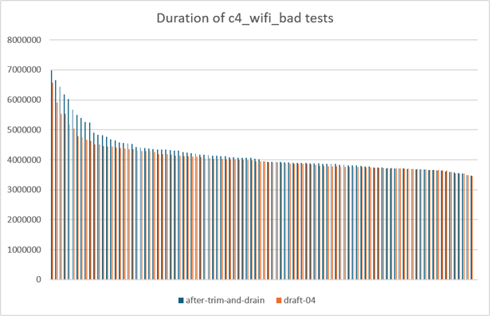
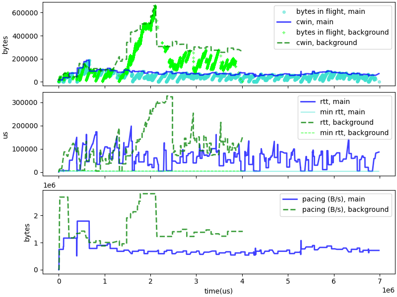
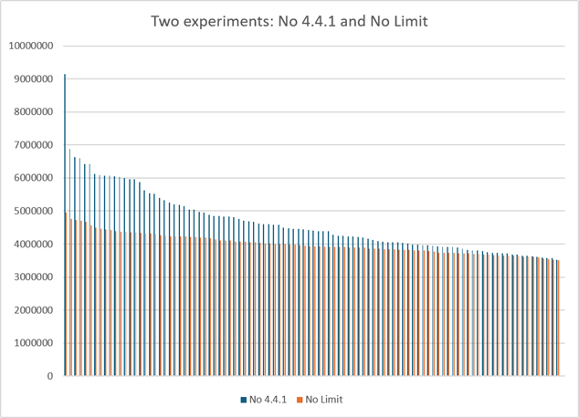

# Analysis of Wi-Fi performance after trimg and drain

After adding the "trimming" and "draining" improvements to C4, we observed
a significant improvement in most of the results, and in particular in the
"buffer bloat" and "compete" scenarios, but we also obsserved a
slight performance degradation for the "bad WiFi" tests.

|  average time for wifi tests| c4 | bbr | cubic | trimming 1/2 | trim+drain |
| --------- | ---:| ---:| ---:| ---:| ---:|
| wifi_bad |  4070606 | 5442735 | 4134315 | 4235194 | 4208666 |

|  top 90% time for wifi tests| c4 | bbr | cubic | trimming 1/2 | trim+drain |
| --------- | ---:| ---:| ---:| ---:| ---:|
| wifi_bad |  4530282 | 7511853 | 4478534 | 4985023 | 4939155 |

The degradation is small on average, about 3.4%, but quite visible for the top 90
values at 9%. Looking at the distribution of results for 100 simulations shows
that while the majority of tests complete in less than 4.2 seconds, some take much
longer.

Some of the discrepancy is expected. The simulation of Wi-Fi jitter is a random
process, and we can expect that different simulations will encounter different
patterns of jitter, and thus different performances. The graph of durations shows
that, but it also shows that the worse 20 or so simulations are significantly
worse "after trim and drain" than with the unmodified "draft-04" implementation.
The performance with draft 04 were on par with Cubic. After the changes, they are worse.

If we plot the evolution of a connection with expected performance versus one with poor
performance, we see an obvious pattern. In the "good" case, we see an event about 1.5 second into
the connection that leads C4 to explore igher RTT and higher data rates, while in the "bad"
case the RTT is constrained into a much narrower band and the pacing rate converges on a
much lower value. In short, it seems like C4 is getting stuck.

The growth pattern of the "good" connection between 1.5 and 2 seconds corresponds to C4
re-entering the Initial state. As we explored performance over Wi-Fi, we observed C4
getting stuck when competing with BBR over bad WI-Fi, and we added special provision
in section 4.4.1 of the specification:

* _C4 will reenter the "initial" phase on the first time
high jitter is detected for the flow. The high jitter
is detected after updating the "nominal max RTT" at the
end of the recovery era, if `running_min_rtt < nominal_max_rtt*2/5`.
This will be done at most once per flow._

There are two ways this provision will fail: either if the first "once per flow"
attempts happens too soon and fails, or if the condition never triggers. To
check that hypothesis, we did two simple experiments: remove the section 4.4.1
rule altogether, or remove the limit on reentering the Initial state just one.

The results of removing the rule 4.4.1 confirms its utility. We see many more connections
with excessive delays -- a worse version of the problem induces by trimming and draining.
On the other hand, removing the limitation to just one reentry of the Initial State
appears to completely solve the problem.

|  average time for wifi tests| c4 | bbr | cubic | trim+drain | No_Limit |
| --------- | ---:| ---:| ---:| ---:| ---:|
| wifi_bad |  4070606 | 5442735 | 4134315 | 4208666 | 4002154 |

|  top 90% time for wifi tests| c4 | bbr | cubic |  trim+drain | No_Limit |
| --------- | ---:| ---:| ---:| ---:| ---:|
| wifi_bad |  4530282 | 7511853 | 4478534 | 4939155 | 4388871 |

|  average RTT for wifi tests| c4 | bbr | cubic | trim+drain | No_Limit |
| --------- | ---:| ---:| ---:| ---:| ---:|
| wifi_bad |  109023 | 65573 | 92571 | 96549 | 109161 |

The performance are better than what we saw with draft-4, and the average RTT
is similar. The change makes sense: the trim and drain modifications are
designed the lower the RTT values, which probably caused a "false start" of the
"2/5th of nominal max RTT" rule, when the value of the RTT was not actually
very large.

There is always a concern that the exception rule designed for Wi-Fi would
cause a regression in other environment, but running the whole series of tests
does not indicate such regression. In particular, the results of the
buffer bloat tests did not change much:

|  average time for buffer bloat tests| c4 | bbr | cubic | trim+drain | No_Limit |
| --------- | ---:| ---:| ---:| ---:| ---:|
| bbloat |  12642775 | 13007783 | 12626193 | 12965662 | 12965362 |
| bbloat_c4 |  20935286 | 25157509 | 20715704 | 20895071 | 20931830 |
| bbloat_bbr |  15320599 | 21358042 | 14414805 | 15921198 | 15886983 |
| bbloat_cubic |  20736042 | 21589509 | 20716566 | 20732693 | 20750217 |

|  top 90% time for buffer bloat tests| c4 | bbr | cubic | trim+drain | No_Limit |
| --------- | ---:| ---:| ---:| ---:| ---:|
| bbloat |  12645052 | 13007879 | 12626287 | 12965764 | 12965480 |
| bbloat_c4 |  21006655 | 39129384 | 20715749 | 20968442 | 21027500 |
| bbloat_bbr |  15431313 | 21437936 | 14520223 | 16124374 | 16092510 |
| bbloat_cubic |  20761314 | 21863392 | 20717165 | 20759397 | 20755921 |

|  average RTT for buffer bloat tests| c4 | bbr | cubic |  trim+drain | No_Limit |
| --------- | ---:| ---:| ---:| ---:| ---:|
| bbloat |  113442 | 84752 | 229647 | 99972 | 99974 |
| bbloat_c4 |  232427 | 92729 | 660442 | 247761 | 191993 |
| bbloat_bbr |  132447 | 124744 | 266277 | 113293 | 113869 |
| bbloat_cubic |  551412 | 97494 | 647602 | 601098 | 598194 |

|  top 90% of RTT + standard deviation for buffer bloat tests| c4 | bbr | cubic | trim+drain | No_Limit |
| --------- | ---:| ---:| ---:| ---:| ---:|
| bbloat |  158066 | 95929 | 322642 | 144800 | 144800 |
| bbloat_c4 |  361518 | 118221 | 939834 | 388331 | 323157 |
| bbloat_bbr |  160200 | 165176 | 408664 | 135484 | 137141 |
| bbloat_cubic |  860075 | 137301 | 1039625 | 956479 | 941952 |

