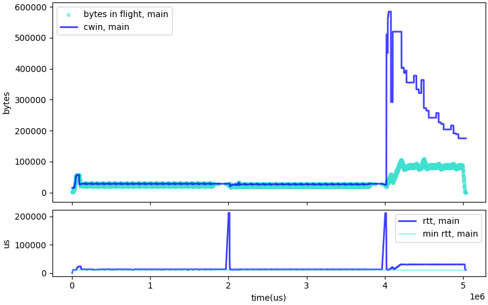
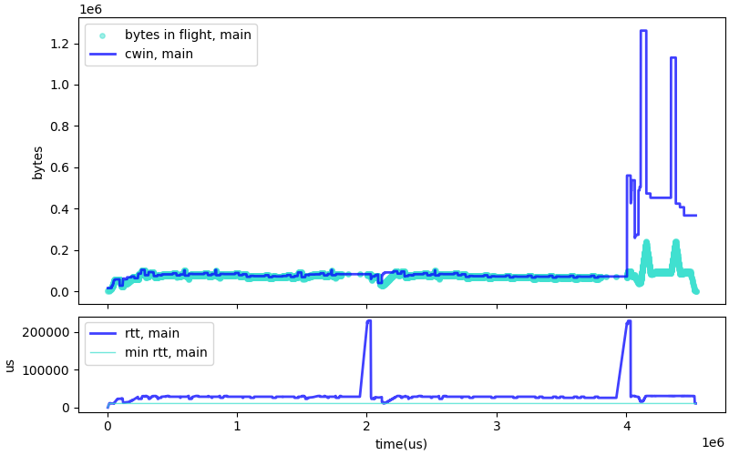
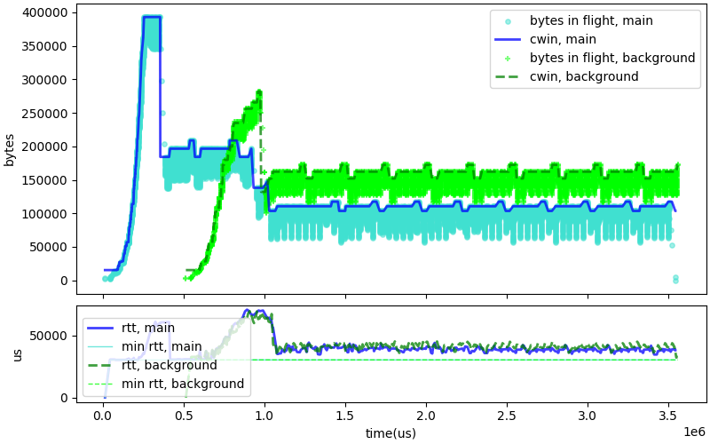
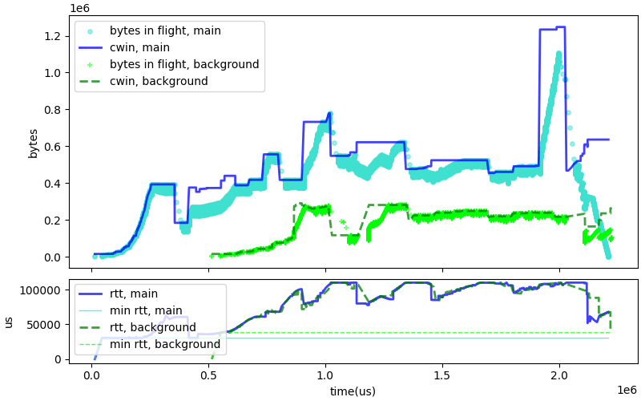
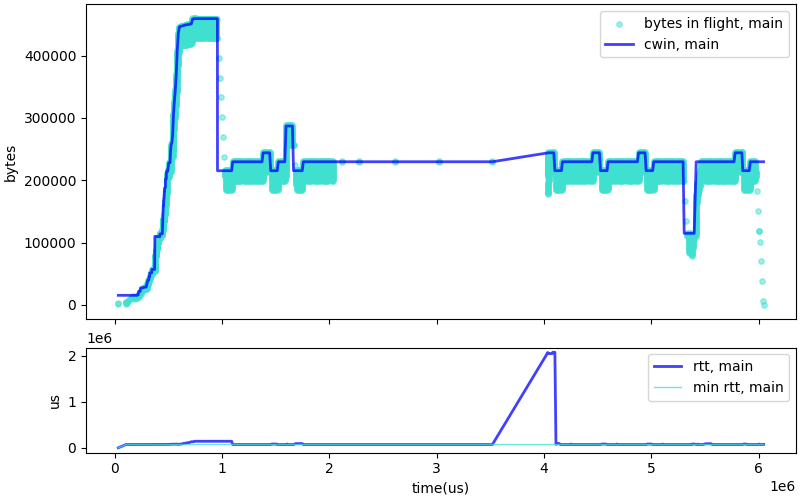
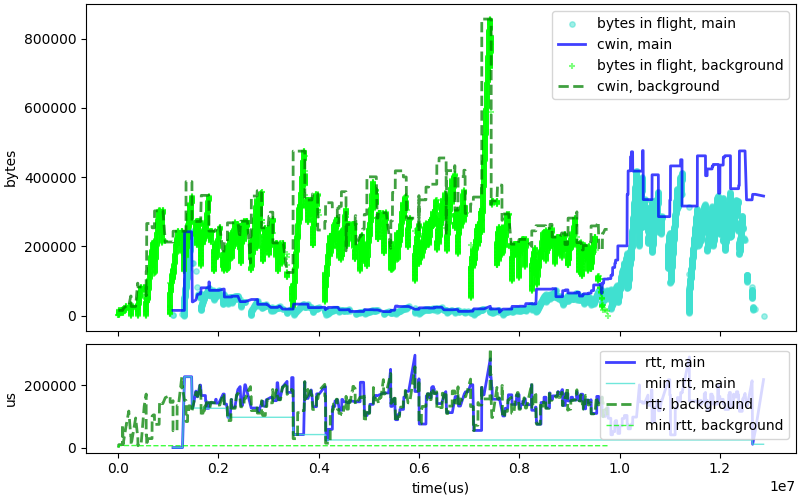

# Removing the chaotic jitter mechanism

After we decided to replace the CWND control based on min RTT by
a looser control based on nominal rate and nominal max RTT,
we saw very good performance in the "bad Wi-Fi" simulations.
Since the "chaotic jitter" detection was primarily motivated
by the bad Wi-Fi scenarios, it makes sense to try suppress
this mechanism and simplify the code. We tried that,
and all the tests were still passing -- except three
of them: wifi suspension, "c4 before c4", and blackhole.
It is interesting to understand why these three tests
failed before actually removing the chaotic jitter
mechanism.

# Chaotic jitter and Wi-Fi suspension test

The figure above shows CWIN and RTT in the suspension test with chaotic-jitter control off.
The graph shows two suspension events, one just before the 2 second mark and another
before the 4 second mark. There is a spike in RTT and window size after the
second suspension. 

We can compare the previous graph with a graph showing what happens with the current code.
The main difference is that when the "chaotic jitter" flag is on, C4 does not react
to delay-based congestion events. We see that with the CWND spiking to 1.2MB in the
"chaotic jitter control on" variant of the test. This does indeed allow the download to complete
faster, but the variant with "chaotic jitter control off" is more regular, with the CWND spike
limited to 600KB.

The new behavior is actually more desirable, and we solve the issue by allowing the
"wifi suspension" test to complete a bit later.

# Chaotic jitter and C4 before C4 competition test

The figure above shows CWIN and RTT in the suspension test with chaotic-jitter control off.
This shows an occurence of "late comer advantage", with the new connection stabilizing
with CWND of about 160K, while the old when sees CWND drop to 110K. This is not ideal,
but it is also within the acceptable range of results, since neither connection is "starving". 

The graph of a typical trial of the same test with the chaotic-jitter control on
explains why the previosu trials were completing faster. The arrival of the
second connection caused the first connection to erroneously detect
a chaotic jitter situation, and turn off the detection of delay-based
congestion. The first connection thus becomes very aggressive, and shuts
down the latecomer. The new behavior is clearly more desirable, resulting
in lower RTT for both connections.

# Chaotic jitter and black hole test

If we remove the chaotic jitter control, the blackhole test completes in 6.1 seconds instead of 6.0
in the previous version. The graph with chaotic jitter control off (above) differs in the way it
reacts to the end of the blackhole: a muted reaction if chaotic jitter control is off,
a very rapid growth of the CWND chaotic jitter control is on and delay based
congestion control is turned off.

The spike of the CWND to 1.75 MB when chaotic jitter control is on is clearly not desirable,
although the rate control limits its effect and we do not see a spike in traffic.
The difference in execution time may be due to the forced slowdown observed
a bit more than 1 second after the end of the black hole. This will be
addressed in another scenario.

# Conclusion

With the chaotic jitter code removed, C4 behaves more regularly. The delay
based congestion control removes many of the spikes in CWND size seen in the
previous version. We still have an issue: the latecomer connection gets a higher
share of the bandwidth than the first connection. We see something
similar happening in the "C4 vs C4 in bad WI-Fi" test, as shown on
the graph below:

The test technically succeeds because it runs in less than 12 seconds,
but we see that the first connections leaves very little bandwidth for
the second one. The first transfer completes in less than 8 seconds,
and the second one starts after that and completes in less than 4 seconds.
The total is less than 12 seconds, but we would expect the two
connections to run in parallel, not one after the other. Turning the
chaotic jitter control off does not fix that -- the results with
the control on or off are similar. We will need to fix that
after we remove the chaotic jitter control.

