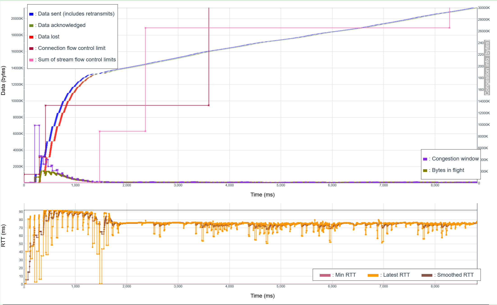
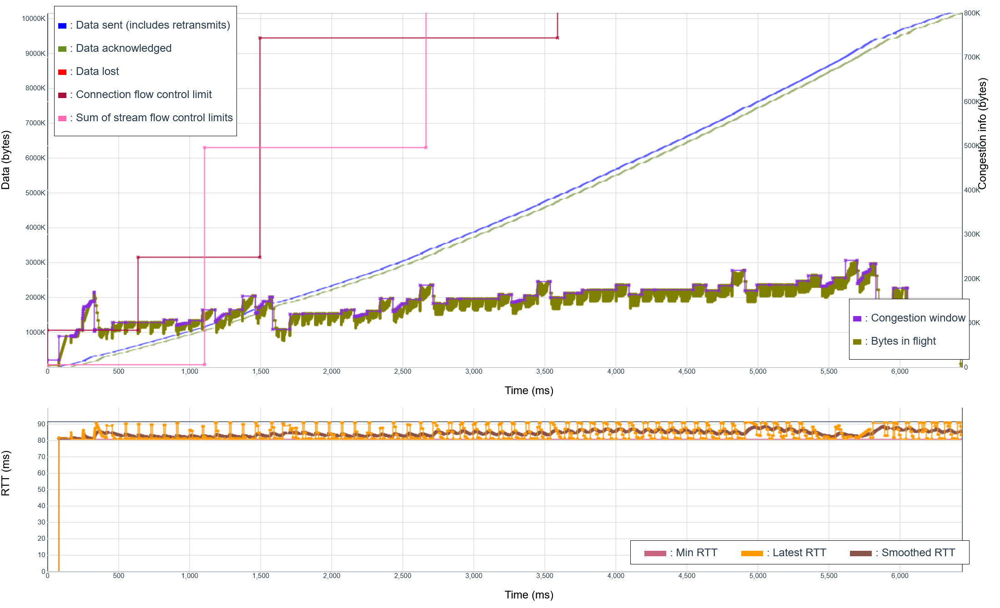
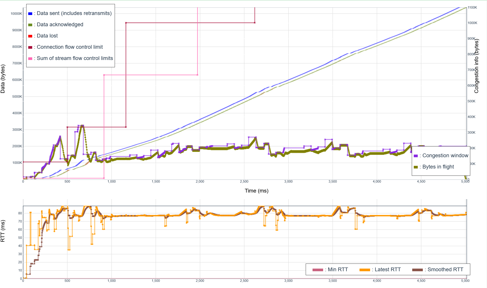
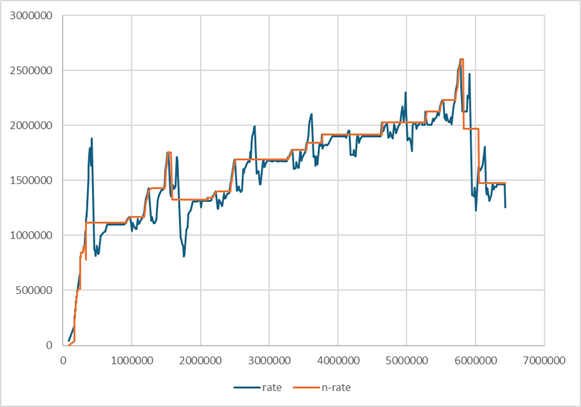
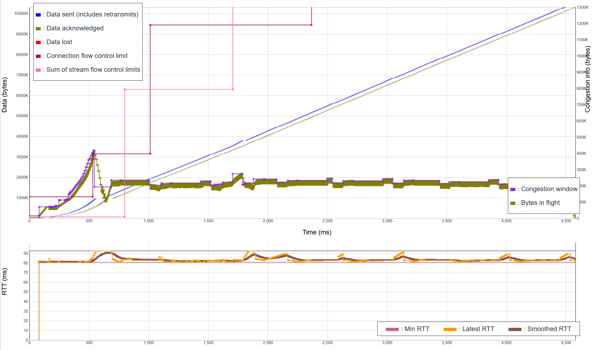
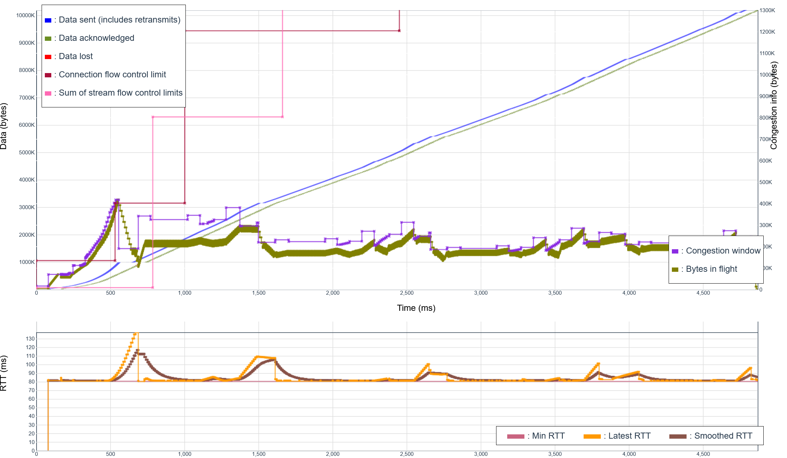

# Adding ECN Support

The first attempt at ECN support was not very convincing.As shown on the qvis congestion graph below,
the connection quickly reaches an excessive rate, endures lots of packet losses, and then stabilizes
at a very low data rate.

There are lots of weird data in this trial:

* During the initial phase, the "nominal RTT" is set to 58,095,238 based on a very first measurement,
  in which the RTT is measured at 21 microseconds, the send delay to 0, with 1220 bytes acknowledged.
  The simulated data rate is 20 Mbps, which means no measurement should have exceeded 2,500,000.
  There is clearly a bug, probably due to some confusion between initial, handshake and 1 RTT packets.
* It takes a long series of losses over 1.3 seconds to drive the data rate back to 2,500,000 MBps.
* The nominal max RTT remains at 21 ms for 3 initial RTTs.
* The RTT measurements are very often below the actual path latency, which probably indicates
  some kind of jitter and ack compression.
* After the initial phase, the data rate oscillates between 800,000 and 1,600,000 Bps, well below
  2,500,000 MBps, probably due to the initial naive implementation of ECN as "similar to packet loss."

This suggests a bunch of fixes before the next trial, starting with fixing the aberrant
initial value of the nominal data rate.

The issue with the initial data comes from mixing data and acknowledgements from different QUIC epochs
(initial, handshake, 1RTT). The simplest fix is for C4 to ignore the packets exchanged in the initial
and handshake epochs. That fixes the excess initial rate observed in the previous trial, but there
are still issues:

* ignoring the initial epoch causes the "media over bad wifi" test to fail, with a maximum
  frame delay jumping from 410ms to 509ms. 
* C4 exits the initial phase early, after receiving an ECN notification.
* The RTT measurements are still very often below the actual path latency.
* After the initial phase, the data rate oscillates between 800,000 and 1,600,000 Bps, well below
  2,500,000 MBps, probably due to the initial naive implementation of ECN as "similar to packet loss."

The tests were made harder by our initial decision to leave the C4 code (c4.c) in the C4 project, and
load it as a submodule in the picoquic project. This turns out to not be too good, because the the
linker building the simulator gets confused between two copies of "c4.o", one in the picoquic core
library and one in the C4 project. It is more reasonable to move the code entirely to the picoquic
project, and only use the C4 project for documentation and simulations.

The draft
[TCP Prague](https://datatracker.ietf.org/doc/draft-briscoe-iccrg-prague-congestion-control/)
request computation of a moving average once per RTT, using the ratio `frac` as the number of
ECN/CE marks over the total number of packets received in that RTT:

~~~
    alpha += g * (frac - alpha);
~~~

In that formula, the gain `g` is by default set to `1/16`. The coefficient `alpha` provides
an estimate of the marking rate at the bottleneck. When congestion is detected, the `ssthresh`
is reduced to:

~~~
    ssthresh = (1 - alpha/2) * cwnd;
~~~

There is a further stipulation that the alpha is initialized to 1 at the first ECN mark, which
ensures that the first ECN mark causes Prague to exit slow start.

We can derive from these specifications that C4 should exit the initial phase at the
first ECN mark, but we have a little ambiguity on the reduction. The "cwnd" coefficient
in Prague is updated in real time, but in C4 it set to a multiple of the nominal
rate and the nominal max RTT, times a coefficient 2 in in the initial phase.
It would make sense to exit slow start and leave the nominal data rate "as is".
The draft however has a caveat, explaining that if multiple connections are
establish, they may trigger frequent marking. Rather than exit slow start on
the first mark, it might be better to only exit when the rate passes some threshold.
It would also make sense to have that threshold be a function of the "sensitivity"
curve.

Thinking further, we have to look at ECN as part of the probing cycle. In
the initial phase, we see a constant increase of the data rate, and thus
averaging the ECN rate or computing era averages over time has little value.
It is better to just run a short term averaging to reduce the effect of noise,
and simply exit the initial phase if the average passes the threshold
corresponding to the sensitivity. There is no much point in dropping the
nominal rate on exit, since entering recovery will take care of that. 

After the initial phase, we have a succession of probing cycles, starting
with recovery, continuing with cruising and possibly probing, and then
returning to recovery either after congestion is detected or probing is
complete. We want to:

* exit cruising or probing if the short-term average of ECN marks is too
  high, and treat that as a congestion signal modulated by the observed
  CE marking rate and the sensitivity.
* in recovery, mark the probing as "congested" if the ECN rate is too
  high, so the next probe happens at a low rate.
* reset averaging at the end of recovery, so averages in the next cycle
  are not skewed by congestion in the previous cycle.

This drives a different implementation than Prague. The ECN rate is
a running exponential average, computed either from the beginning
of the Initial phase or from the end of the previous Recovery phase.
It should probably be computed after each ACK, by checking for
arrivals of new marks.

The first attempt is to set the "ecn threshold" as function of sensitivity:
25% for sensitivity 0, 12.5% for sensitivity 1, linear interpolation between
the two. Then, we set the "beta" value as the max of 25% and the ratio between
the "excess ECN alpha" and the threshold. This gets us the following graph:

It is encourating. The passing mark for the "C4 alone" test was a completion in
less that 5 seconds, this test completes in 5.01 seconds while maintaining the
RTT variations in a narrow range. There are however a few issues:

- We observe packet losses after the exit from the Initial phase,
- We observe something a re-entry in a second Initial phase
  shortly afte the first one, and significant packet losses after
  exiting that phase,
- The data rate seems to stabilize at 2MB/s, which would be
  only 80% of capacity.

But the graph above shows a concerning pattern: delay measurements fall below the
simulated link latency, which indicates a bug in the implementation of
the "dual queue AQM" in the picoquic simulator. After fixing these bugs,
the graph is a bit different.

Apart from fixing the simulator, this graph includes two fixes:

- The sensitivity coefficient varies between 9.75% and 18.75% instead of between 12.5% and 25%,
- The alpha coefficient for the pushing phase is set to either 6.25% if the previous push
  was not successful, or if it was successful to a rate varying between 25% if the coefficient
  ECN alpha was null and 6.25% if that coefficient was large.

The graph looks better, but there are still some concerns, which become obvious when we look
at the evolution of the nominal data rate:

- C4 exited the initial phase a bit early, at a rate of 1.1 MB/s instead of the nominal 2.5MB/s
- C4 also exited the "push" phases early, or discovered congestion well below the expected 2.5MB/s

Examining the traces showed that the computation of the coefficient alpha was reasonably accurate.
There were just too many CE marks, meaning probably too many packets in the queue.

Could this be due to the way C4 configure pacing? If the "quantum" coefficient is too large,
C4 will allow sending a big "train" of packets whenever the congestion window is relaxed. This
will instantly fill the queue, causing the DualQ controller to start marking a fraction of the
packets with `ecn=CE`. The DualQ controller is programmed to start marking packets if the
queue is more than 5ms deep, increase the marking rate as the queue grows, and then mark every
packet if the queue is more than 15ms deep. To avoid CE marks, C4 would have to keep the
queue smaller than 5ms, which implies that the quantum should be less than 5ms of packet.
The initial code was setting the quantum to 1/4th of CWND, which is only less than 5ms
if the RTT is less than 20ms.

The initial code was also setting the pacing rate in the initial phase to more than the
double of the nominal rate (250%). This was means as a way to find the nominal rate
sooner by allowing "chirping", but it has the effect of building queues as soon as the
nominal rate is 80% of the target value. The DualQ controller sees these queues and
increases the marking rate, causing the early exit of the initial phase.

Fixing the quantum to 4ms of traffic does indeed fix the issue. The transmission rate reaches
the expected value of 2.5MB/s, and the RTT remains pegged near the min RTT, only bumping up
by at most 10ms during the Initial state and the pushing state. The only remaining problem is
that we do see occasional packet losses after the Initial phase, and also after a
pushing phase trying a 25% rate increase. The log file shows that the packet losses
happen at almost the same time as the increase in the marking rate, which reaches 80%
or higher.

This is probably caused by the dynamics of the DualQ AQM. Endpoints use ECN signals as
an indication of congestion. When they receive CE marks, they react by reducing their
sending rate, but the AQM will only see the effect of that rate reduction 1 RTT after
the CE mark. In between, the queue will build up rapidly, and may reach the threshold
at which the AQM starts dropping packets. Examining the code, it turns out that this
was a bug in the picoquic implementation. The limit is supposedly set to the total
amount of buffers available, but instead was set to a constant.

After fixing that bug, the packet losses are gone. A direct consequence is that the
delays increase during the initial and pushing phase. When the limit was set to a
low value, packet that would cause a delay above the limit were immediately
dropped, which would place a cap to the maximum RTT. When the buffering is
not arbitrarily limited, we allow some packet queues to build. However, we can
see that after a short period the pushing phases are limited to a 6.25%
increase, which only causes minimal delays. Outside of pushing phases, the
delays are nearly equal to the min RTT.