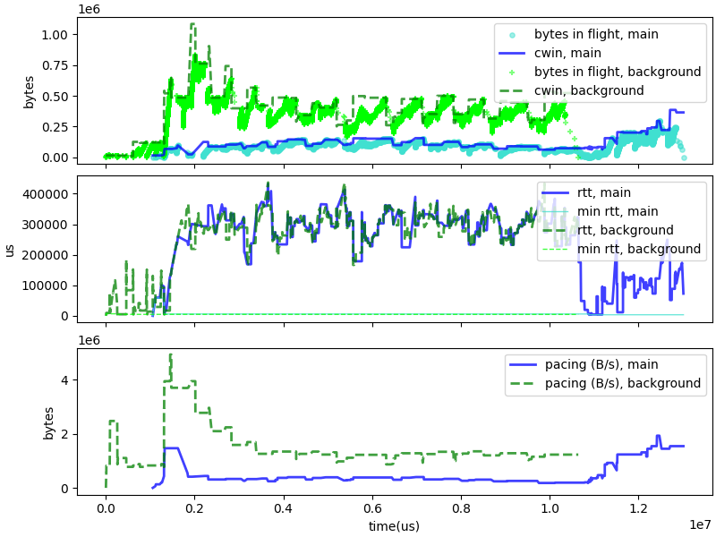
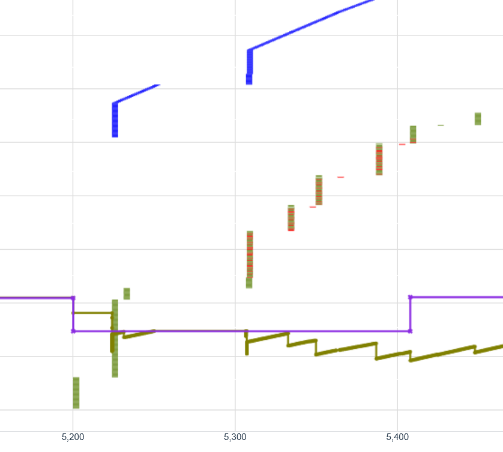

Fixing rate increases:

## Try to estimate the min RTT by computing the duration of the previous era:

Really bad idea. All kinds of regressions, including the media test. We may need to make the
bandwidth estimate more precise, but this isn't it.

## Use an estimate of the max data rate of the previous era
either by conserving the
value in the "apply" function, or simply comparing to "alpha previous"

Bad idea. Too much cooking...

## use the limit computed by picoquic
~~~
#if 0
            /* EXP: Consider limits if picoquic already knows the max bandwidth estimate */
            if (max_rate > path_x->bandwidth_estimate_max &&
                path_x->bandwidth_estimate_max > 0) {
                max_rate = path_x->bandwidth_estimate_max;
            }
#endif
~~~
Turns out to not be a great idea. The media test does not improve much, the wifi tests get worse.
Surprisingly, the limit can increase above the link rate.

Hypothesis: this makes C4 slightly less aggressive, with bad consequences in scenarios that need
some aggressivity.

## notice when the rate has been limited

ANd consider that the raw measurement would have allowed growth.
Does not reset the "cascade" growth in these cases.

Not a great effect on the media test -- average delay for 1020p frame now 120ms instead of 110. (Butterfly?)
The bandwidth stabilizes at 7.5MB/s, five times the actual rate. Bizarre, since the connection never fills the
CWIN. Is there a bug in the way picoquic computes the acked bytes?

The c4 vs c4 traces with bad wifi do not look good. The first connection gets a lot of the bandwidth, the second starves. 
This is not really a regression, just something that the change does not fix.

C4 vs C4 over WI-Fi not good: first connection shuts down the second one.

The long c4 vs. c4 test looks very good, but we see queue build up when the connection is alone. The data rate is slightly too large.
We see a deep bandwidth drop during the recovery periods, followed immediately by resetting the BW to previous value, or almost
Hypothesis: C4 drops 25% due to some congestion signal *before* entering recovery, but then ACKs lead to recomputing the BW.
That's less than ideal.

## Reduce effect of delay based congestion based on sensitivity

Media test performance degrades: average delay for 1020p frame now 120ms instead of 110.
~~~
Simulated time 6374042, expected 6250000
10: c4_vs_c4.txt returns -1 after 34 trials. (butterfly?)
~~~

Bad WIFi c4 vs cubic seems to have improved a bit -- C4 gets unstuck faster.
C4 vs C4 over WI-Fi not good: first connection shuts down the second one.

Overall, Meh.

TODO: investigate the drop and bounce behavior. Why do we see that?

## Only do bandwidth upgrades in recovery?

Media passes all tests. Stabilizes at 4MB/s, still too much but not quite as bad.
~~~
Simulated time 7619920, expected 7600000
3: c4_low_and_up.txt returns -1 after 0 trials.

Simulated time 5202962, expected 4300000
16: c4_wifi_bad.txt returns -1 after 84 trials
~~~
C4 stuck operating at about 0.8 Mbps for 2.5 seconds -- 30% of capacity. Then
gets unstuck, reaches expected 1.25MB/s.
~~~
Media 1 (vlow), latency average 82904.229167, expected 75000
5: c4_media_wb.txt returns -1 after 4 trials.

Simulated time 6485096, expected 6250000
10: c4_vs_c4.txt returns -1 after 80 trials. (This really looks like a butterfly)
~~~
Bad Wi-Fi C4 vs C4 just as bad as usual.

Probably not the right solution. But there is something there. The dips in the CWND
curve are still very much present, but there is no corresponding dip in the
data rate curve.

Are they caused by dropping both bandwidth and data rate?
Should we consider some hysteresis?

## Analysis of the C4 vs C4 long connection

Looking at the first connection in the test `c4_vs_c4_lg`. Looking at the log,
we see the connection ramping up, until we get to the point where the
pacing rate exceeds the path capacity (26Mbps vs. 20Mbps).

### Analysis of initial phase
This is in the
initial phase, `alpha=2`, thus the nominal rate is about 13 Mbps. Shortly
after, we observe packet losses.
~~~
[689370, "recovery", "metrics_updated", {"cwnd": 210485,
       "pacing_rate": 26122448,"bytes_in_flight": 208800,
       "smoothed_rtt": 123633,"latest_rtt": 144900}],
...
[738820, "transport", "packet_received", { "packet_type": "1RTT", "header": { "packet_size": 55, "packet_number": 89, "dcid": "030b057a71666bf2" }, "frames": [{ 
    "frame_type": "ack", "ack_delay": 28, "acked_ranges": [[320, 322], [299, 316], [135, 297]]}, { 
    "frame_type": "padding"}]}],
[738820, "recovery", "packet_lost", {
    "packet_type" : "1RTT",
    "packet_number" : 317,
    "trigger": "repeat",
    ...
~~~
In response to the losses, C4 enters recovery, with `alpha=0.9375`. The pacing
rate should drop to about 12Mbps. Instead, we see:
~~~
[738820, "recovery", "metrics_updated", {"cwnd": 98664,"pacing_rate": 9795918,
       "bytes_in_flight": 191520,"smoothed_rtt": 134624,"latest_rtt": 156401}],
~~~
That is, C4 applied a 25% reduction due to congestion. *This is probably wrong*:
the congestion is due to the large value of alpha during the `initial` stage,
but moving to recovery already fixed that.

We see further losses, and the pacing rate is reduced again:
~~~
[746070, "recovery", "metrics_updated", {"cwnd": 92498,"pacing_rate": 9186602,
       "bytes_in_flight": 165600,"smoothed_rtt": 136958,"latest_rtt": 153300}],
~~~
Not clear why. This may be due to delay based congestion. We are seeing a reduction
of about 6.22%. Or this may be due to reentering recovery (unlikely). In any
case, that's not really justified. The pacing rate will increase slightly
after receiving a new ACK:
~~~
[766995, "transport", "packet_received", { "packet_type": "1RTT", "header": 
    { "packet_size": 55, "packet_number": 92, "dcid": "030b057a71666bf2" }, "frames": [{ 
    "frame_type": "ack", "ack_delay": 28, "acked_ranges": [[335, 357], [320, 329], [299, 316]]}, { 
    "frame_type": "padding"}]}],
[766995, "recovery", "metrics_updated", {"cwnd": 93610,"pacing_rate": 9297820,
    "bytes_in_flight": 141120,"smoothed_rtt": 140509,"latest_rtt": 151576}],
~~~
We are not out of recovery yet, not until there is an ACK for packet 446, the first
packet sent in recovery. The rate increase is probably due to the ACK causing
an increase in the nominal rate. We see the same pattern playing out again:
~~~
[798045, "transport", "packet_received", { "packet_type": "1RTT", "header":
    { "packet_size": 55, "packet_number": 96, "dcid": "030b057a71666bf2" }, "frames": [{ 
    "frame_type": "ack", "ack_delay": 746, "acked_ranges": [[335, 379]]}, { 
    "frame_type": "padding"}]}],
[798045, "recovery", "metrics_updated", {"cwnd": 93951,"pacing_rate": 9327935,
    "bytes_in_flight": 109550,"smoothed_rtt": 144914,"latest_rtt": 154457}],
...
[809545, "transport", "packet_received", { "packet_type": "1RTT", "header":
    { "packet_size": 55, "packet_number": 97, "dcid": "030b057a71666bf2" }, "frames": [{ 
    "frame_type": "ack", "ack_delay": 28, "acked_ranges": [[335, 391]]}, { 
    "frame_type": "padding"}]}],
[809545, "recovery", "metrics_updated", {"cwnd": 93966,"pacing_rate": 9335494,
    "bytes_in_flight": 92270,"smoothed_rtt": 145674,"latest_rtt": 151001}],
...
[819895, "transport", "packet_received", { "packet_type": "1RTT", "header":
    { "packet_size": 55, "packet_number": 98, "dcid": "030b057a71666bf2" }, "frames": [{ 
    "frame_type": "ack", "ack_delay": 1106, "acked_ranges": [[335, 394]]}, { 
    "frame_type": "padding"}]}],
[819895, "recovery", "metrics_updated", {"cwnd": 95016,"pacing_rate": 9434889,
    "bytes_in_flight": 90830,"smoothed_rtt": 146555,"latest_rtt": 152727}],
~~~
Until we receive an ACK for the recovery packet:
~~~
888895, "transport", "packet_received", { "packet_type": "1RTT", "header":
    { "packet_size": 55, "packet_number": 103, "dcid": "030b057a71666bf2" }, "frames": [{ 
    "frame_type": "ack", "ack_delay": 597, "acked_ranges": [[433, 457], [431, 431], [335, 427]]}, { 
    "frame_type": "padding"}]}],
[888895, "recovery", "metrics_updated", {"cwnd": 201937,"pacing_rate": 10061135,
    "bytes_in_flight": 80640,"smoothed_rtt": 143473,"latest_rtt": 93199}],
~~~
At that point, we enter "cruising". The pacing rate now matches the nominal
rate -- the previous rate 9,434,889 was 93.75% of 10,061,135. 

### Analysis of the next pushing phase

We do see
further increases of the pacing rate following ACK:
~~~
[1283961, "transport", "packet_received", { "packet_type": "1RTT", "header":
    { "packet_size": 55, "packet_number": 140, "dcid": "030b057a71666bf2" }, "frames": [{ 
    "frame_type": "ack", "ack_delay": 100, "acked_ranges": [[678, 785]]}, { 
    "frame_type": "padding"}]}],
[1283961, "recovery", "metrics_updated", {"cwnd": 202739,"pacing_rate": 10696378,
    "bytes_in_flight": 125280,"smoothed_rtt": 97274,"latest_rtt": 99286}],
~~~
Until we see the pacing rate drop again to the recovery rate:
~~~
[1390336, "transport", "packet_received", { "packet_type": "1RTT", "header":
{ "packet_size": 55, "packet_number": 150, "dcid": "030b057a71666bf2" }, "frames": [{ 
    "frame_type": "ack", "ack_delay": 100, "acked_ranges": [[678, 875]]}, { 
    "frame_type": "padding"}]}],
[1390336, "recovery", "metrics_updated", {"cwnd": 178887,"pacing_rate": 9434889,
    "bytes_in_flight": 138240,"smoothed_rtt": 100531,"latest_rtt": 102901}],
~~~
Which is weird, because we did not see an increase for moving to a "pushing"
state, and there are no packet losses. On the other hand, C4 has discovered
a nominal rate of about 50% of bandwidth, which is fine because there are two
competing connections.

We do see an increase of the pacing rate a bit later, following an ACK.
That may have been caused by an exit from recovery. 
~~~
[1506486, "recovery", "metrics_updated", {"cwnd": 194921,"pacing_rate": 10627306,
    "bytes_in_flight": 136800,"smoothed_rtt": 107292,"latest_rtt": 112601}],
[1506569, "transport", "packet_sent", { "packet_type": "1RTT", "header":
    { "packet_size": 1424, "packet_number": 1070, "dcid": "b6eab272e492143b" }
...
~~~
But the clearest indication of "pushing" is seen when the pacing rate jumps 
to 13.2 Mbps, a 25% increase from 10.6Mbps.
~~~
[1622061, "transport", "packet_received", { "packet_type": "1RTT", "header": { "packet_size": 55, "packet_number": 172, "dcid": "030b057a71666bf2" }, "frames": [{ 
    "frame_type": "ack", "ack_delay": 28, "acked_ranges": [[975, 1071]]}, { 
    "frame_type": "padding"}]}],
[1622061, "recovery", "metrics_updated", {"cwnd": 236897,"pacing_rate": 13271889,
    "bytes_in_flight": 151200,"smoothed_rtt": 112033,"latest_rtt": 114184}],
[1622330, "transport", "packet_sent", { "packet_type": "1RTT", 
    "header": { "packet_size": 1424, "packet_number": 1177, "dcid": "b6eab272e492143b" },
~~~
We do see a drop in pacing rate until a bit later, when the first packet sent
after pushing is acked.
~~~
[1749136, "transport", "packet_received", { "packet_type": "1RTT", "header":
    { "packet_size": 55, "packet_number": 185, "dcid": "030b057a71666bf2" }, "frames": [{ 
    "frame_type": "ack", "ack_delay": 28, "acked_ranges": [[975, 1181]]}, { 
    "frame_type": "padding"}]}],
[1749136, "recovery", "metrics_updated", {"cwnd": 177672,"pacing_rate": 9956784,
    "bytes_in_flight": 204480,"smoothed_rtt": 118135,"latest_rtt": 123114}],
~~~
This is a big drop from +25% to -6.25%. We see then a couple of intermediate increase:
~~~
[1770411, "recovery", "metrics_updated", {"cwnd": 179877,"pacing_rate": 10087565,
"bytes_in_flight": 175680,"smoothed_rtt": 120040,"latest_rtt": 127047}],
...
[1813536, "recovery", "metrics_updated", {"cwnd": 180036,"pacing_rate": 10096406,
"bytes_in_flight": 167040,"smoothed_rtt": 125815,"latest_rtt": 137512}],
~~~
Followed by a decrease, which can only have been caused by delay
based congestion given the absence of packet loss and the RTT:
~~~
[1876786, "recovery", "metrics_updated", {"cwnd": 171960,"pacing_rate": 9640167,
  "bytes_in_flight": 168480,"smoothed_rtt": 138220,"latest_rtt": 153938}],
~~~
After that, we see some potential packet losses, but they are not yet validated.
The bandwidth drop is probably due to excess delays:
~~~
[1898061, "transport", "packet_received", { "packet_type": "1RTT", "header":
    { "packet_size": 55, "packet_number": 199, "dcid": "030b057a71666bf2" }, "frames": [{ 
    "frame_type": "ack", "ack_delay": 100, "acked_ranges": [[1311, 1311], [1118, 1309]]}, { 
    "frame_type": "padding"}]}],
[1898061, "recovery", "metrics_updated", {"cwnd": 176594,"pacing_rate": 9896907,
    "bytes_in_flight": 159840,"smoothed_rtt": 142952,"latest_rtt": 159604}],
~~~
We then see the exit from recovery, and the rate going back up:
~~~
[1908411, "transport", "packet_received", { "packet_type": "1RTT", "header": { "packet_size": 55, "packet_number": 200, "dcid": "030b057a71666bf2" }, "frames": [{ 
    "frame_type": "ack", "ack_delay": 28, "acked_ranges": [[1311, 1323], [1118, 1309]]}, { 
    "frame_type": "padding"}]}],
[1908411, "recovery", "metrics_updated", {"cwnd": 179587,"pacing_rate": 10069930,"bytes_in_flight": 159840,"smoothed_rtt": 145098,"latest_rtt": 160125}],
~~~

### Lesson from first analysis

There is a spurious congestion signal applied at the end of Initial. This
is probably not needed, since it is based on the large alpha, not on an excessive
initial bandwidth.

The nominal rate of the two competing connections in the "c4 vs c4" test
stabilize a bit above 10.3 Mbps, for a total about 6% above the simulated
data rate. This cause excess delays and occasional losses, but it would be
nice to see a data rate go just under the max rather than just above.

## Analysis of the C4 vs C4 bad Wi-Fi connection

We see a recurring failing pattern in the competition tests under
"bad Wifi". The initial connection quickly discovers the available
bandwidth and stabilizes at that rate. The second connection
has to wait for the end of the previous one before it can
get the bandwidth.

There are two reasons for this behavior: the first connection never
backs off, and the second connection never manages to push
forcefully enough. This is hard to fix, because we have the same
code on both connection: making it more or less aggressive
will play on both sides. Also, we need C4 to be aggressive
enough to compete against Cubic and BBR.

To complement this point, it is interesting to show the timing of losses for both connections.
They appear to happen at almost the same time, especially if we allow for the slight phase
differences between the two logs. 

Let's analyze the details.

### Dropping packets

Loss happen at the same time on the two connections. That is expected:
packets are dropped when the router's buffer
is full, and packets from both connections will be dropped. We can also see that when the
two connections compete the first one see one sees 340 losses for 7000 packets, the second one
120 losses for 1400 packets. That's more surprising, as we would expect the two connections
to experience the same rate of packet loss.

A plausible explanation is that losses happen to batches of packets. If a connection
sends a batch of 10 packets towards a full queue, it will lose 10 packets. If
it had send only 5, waited a bit and then sent the next 5, it would only have lost
5. The size of these batches is tied to the size of the "leaky bucket" used
for pacing, the "quantum" coefficient in C4' algorithm. Currently, it
is set as:
~~~
quantum = max ( min (cwnd / 4, 64KB), 2*MTU)
~~~
This formula means that soon as CWND is big enough, we will get a large quantum.
If we changed the formula to use `cwnd/8` instead of CWND/4, we would get:

CWND/Fraction|0.25|0.125
----|----|-----
16000|4000|3072
100000|25000|12500
180000|45000|22500
400000|65536|50000

The quantum for the low and high data rate connections (CWND 180,000 and 400,000)
are rather similar with the '1/4' fraction, will be significantly different 
with 1/8. So, this looks like something that might help.

Except, it doesn't. Or at least not quite.
Doing a trial of the same scenario with the quantum factor set
to cwnd/8, we see an increase in the number of losses experienced by both the
1st connection (441 instead of 340) and even more dramatically for the second
connection (443 instead of 120). The positive side is that the second connection
ramps up a little faster, reaching about 3.2Mbps during the compete phase instead
of barely 1 Mbps previously. The test fails, largely because after the 1st connection
completes the 1st connection does not ramp up quickly enough to use all the
available bandwidth.

### Not backing off after causing packet losses

Let's look at a snippet of a QVIS congestion graph for the first
connection, a few seconds after the start:

The "CWND" line (purple) shows the drop at the beginning of a
recovery phase, and a step back to the previous value at the
end. It also shows several red marks indication packet
losses, but there is no congestion response happening.

This is largely by design -- by the current design in any case.
The recovery follows a "pushing" phase, during which the
pacing rate was deliberately set higher than the nominal
value. The packet losses do not indicate than the nominal
rate cannot be sustained, so the initial analysis was that
there there is no need to lower it. But maybe we need to think again.

The 1st connection operates at nearly the link rate. Any increase in
bandwidth quickly saturates the router's buffer, causing losses
that are perceived by both connections. For the second connection,
these losses may happen during a "cruising" ere, causing a backoff.
So we have a situation where one connection creates an instant
congestion, does not back off, and causes others to back off. That does
not seem right.

### Dropping off quickly on packet losses

The two logs do not use synchronized clocks, so the slice corresponding
to 5 to 6 seconds after the start in the first log corresponds to
4 to 5 seconds in the second log. We see the following:
~~~
...
[3740761, "recovery", "metrics_updated", {"cwnd": 65172,"pacing_rate": 1759584,
    "bytes_in_flight": 40320,"smoothed_rtt": 179191,"latest_rtt": 198141}],
...
[4118349, "recovery", "metrics_updated", {"cwnd": 45824,"pacing_rate": 1237246,
    "bytes_in_flight": 57600,"smoothed_rtt": 245086,"latest_rtt": 387193}],
...
[4142311, "recovery", "metrics_updated", {"cwnd": 46220,"pacing_rate": 1247968,
    "bytes_in_flight": 38880,"smoothed_rtt": 280987,"latest_rtt": 325180}],
...
[4155907, "recovery", "metrics_updated", {"cwnd": 47363,"pacing_rate": 1278863,
    "bytes_in_flight": 44640,"smoothed_rtt": 286574,"latest_rtt": 325683}],
...
[4332158, "recovery", "packet_lost", {
    "packet_type" : "1RTT",
    "packet_number" : 425,
    "trigger": "repeat",
    "header": {
        "packet_type" : "1RTT",
        "packet_number" : 425,
        "dcid" : "f69840d5eecd6f52",
        "packet_size" : 1424}}],
[4332158, "recovery", "metrics_updated", {"cwnd": 60106,"pacing_rate": 1364120,
    "bytes_in_flight": 30240,"smoothed_rtt": 288646,"latest_rtt": 180711}],
....
[4562082, "transport", "packet_received", { "packet_type": "1RTT", "header": { "packet_size": 55, "packet_number": 100, "dcid": "b413da1ff7364bc4" }, "frames": [{ 
    "frame_type": "ack", "ack_delay": 1142, "acked_ranges": [[426, 433], [422, 423], [419, 419], [413, 413], [409, 410], [406, 407], [404, 404], [344, 402]]}, { 
    "frame_type": "padding"}]}],
[4562082, "recovery", "metrics_updated", {"cwnd": 42262,"pacing_rate": 959120,
    "bytes_in_flight": 57600,"smoothed_rtt": 302195,"latest_rtt": 397039}],
...
[4595992, "transport", "packet_received", { "packet_type": "1RTT", "header": { "packet_size": 55, "packet_number": 103, "dcid": "b413da1ff7364bc4" }, "frames": [{ 
    "frame_type": "ack", "ack_delay": 1142, "acked_ranges": [[426, 450]]}, { 
    "frame_type": "padding"}]}],
[4595992, "recovery", "metrics_updated", {"cwnd": 42760,"pacing_rate": 970432,"bytes_in_flight": 33120,"smoothed_rtt": 301274,"latest_rtt": 275117}],
...
[4612351, "recovery", "metrics_updated", {"cwnd": 48525,"pacing_rate": 1101233,"bytes_in_flight": 34560,"smoothed_rtt": 293918,"latest_rtt": 242432}],
~~~
What events do we see?

1. At t=4118349, the pacing rate drops from the previous 1.76 Mbps down to 1.24 Mbps. This is
   due to a large RTT measurement causing a 25% drop to 1.32 Mbps, followed by a 6.25% drop for
   entering recovery at 1.24 Mbps.
2. A series of increases in bandwidth as packets sent at the previous rate of 1.76 Mbps are
   acknowledged, allowing the pacing rate to climb back up to 1.278863 Mbps, then 1.364120 Mbps
   as C4 exits recovery.
3. At t=4562082, the pacing rate drops again by 25% from 1.364120 Mbps to 1.023061 Mbps due to
   the large RTT sample, and then 6.25% to 0.959120 Mbps upon entering recovery.

Interestingly, the packet losses did not play a big role there. The big drops were
caused by excessive delays. 

### Lessons

First lesson, we really need to look at details of traces to understand what happened.

Second lesson, the fairness of competition is predicated upon all endpoints having
consistent evaluations of the Max RTT. Here, this fails. The 2nd connection will
only recognize the big RTT spikes as valid Max RTT samples if they happen
during a recovery period. Since C4 is in recovery state only about 1/6th of
the time, the first 5 such events will cause the bandwidth to drop.

We need to solve this faster, but also we don't want to create a delay
spiral. We need to devise some kind of safety there.

Third lesson, pushing and causing losses with no consequence does not feel
right. At a minimum, we ought to refuse to increase the bandwidth if the
pushing was causing packet losses. 

(details needed)
