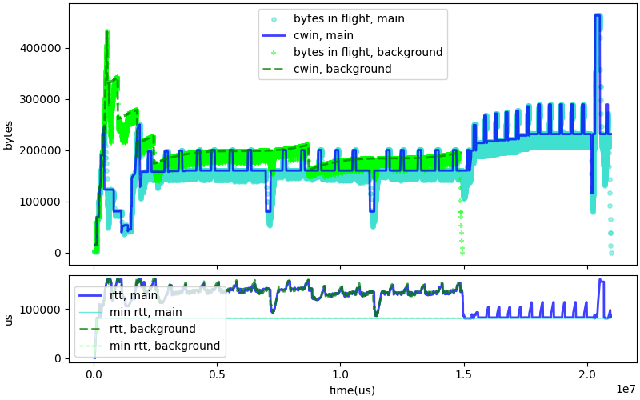
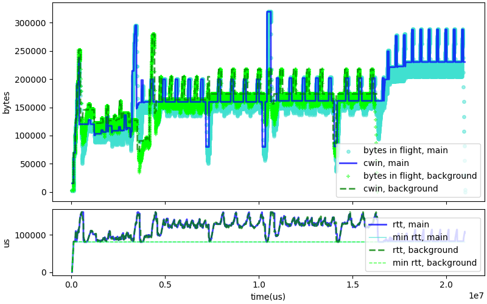
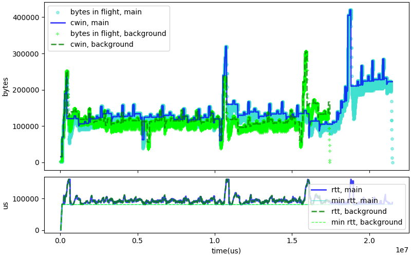
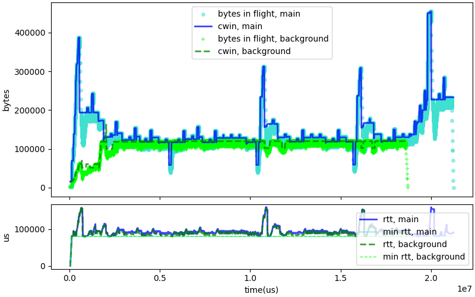
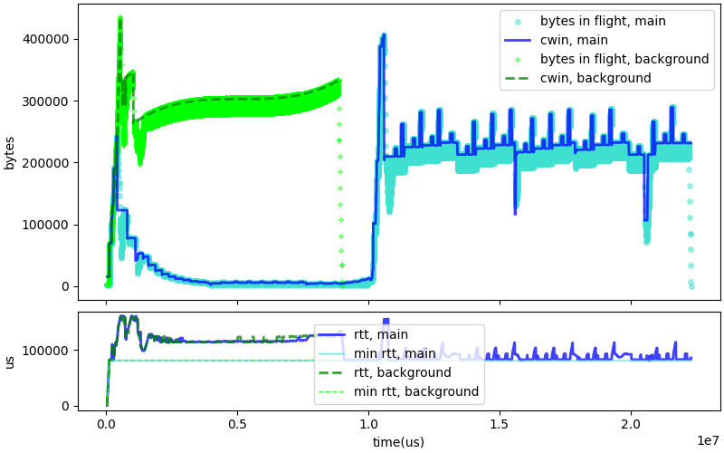
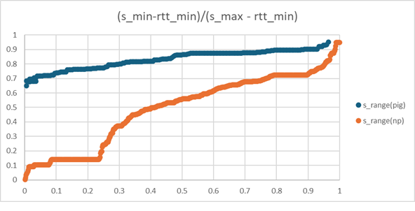
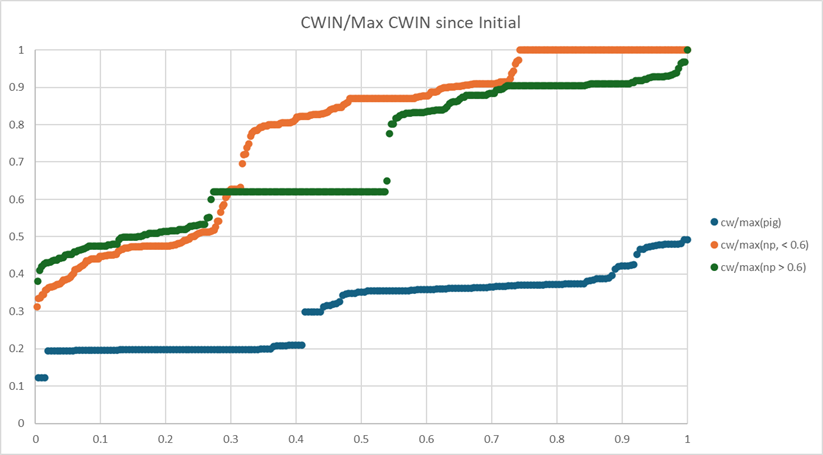
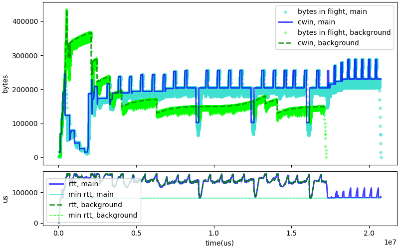
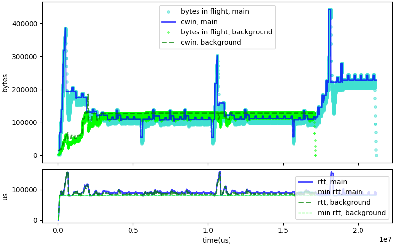

# Detection of competition

C4 detects the onset of competition with a "non responsive"
connection after three successive 
delay based congestion events, and sets the "pig_war" flag.
When that flag is set, C4 stops responding to delay based
congestion signals, and re-enters the "initial" phase to
reassess the congestion window. The flag will be cleared when
the congestion eases.

The graph shows this algorithm at work. At the beginning ,
both connections increase their CWND per their
startup algorithm. After that, we see decreasing values for C4 value of
CWND, as it mistakes the increased delays caused by Cubic for congestion
events. After 1.5 second, C4 detects the competition, enters
the "pig war" mode, and performs a new startup. After that,
C4 uses a CWND that is roughly on par with Cubic. After 15 seconds,
the Cubic connection stops. C4 quickly discovers the available
bandwidth, while maintaining a low RTT.

However, while the graph shows a case where the detection works well,
we also see a significant amount of "spurious" detection, turning
into pig-war mode when facing benign competition with BBR or C4 itself,
or maybe facing no competition at all. 

# Spurious triggering of Cubic detection

The analysis of a "C4 versus C4" tests shows that the "pig war"
mode can be unexpectedly detected.

In this example, the "pig war" mode is triggered after 3 seconds for
the first connection, and after 4 second by the second one. After
that, the 2 connections stop reacting to delays. They do reach a
reasonable equilibrium, but the RTT is about 30% larger than the
expected minimum.

We did a run of the same test in which the pig-war detection is disabled.
The two connections reach a reasonable equilibrium, and the observed RTT
is much shorter.

We also did a test of the competition between C4 and BRR, with the test
disabled. Again, the results look quite good, with BBR and Cubic
reaching a reasonable equilibrium and maintaining low RTT.

The spikes in delay in that graph are caused by the slowdown algorithm,
which notices a slight increase in the min RTT and triggers a rerun
of the initial start up. We will discuss that in another paper.

Of course, if we disable the "pig war" test, C4 becomes very vulnerable to competition
with Cubic. We did that test, and the result is clear: Cubic drives the C4
bandwidth to almost zero, and the C4 connection only takes up speed after
the Cubic connection stops.

Disabling the pig war test is not a solution. On the other hand, the current
pig war test also fires when competing with another C4 connection, or
with BBR. The good solution would be to find an algorithm that only
triggers in the "Cubic" scenario.

# Improving pig-war detection

To try find a better test, we ran a series of simulations and capture the
instant at which the first "pig war" signal was detected. We then tried
to find a specific signal that would allow us to discriminate between
correct and incorrect detections.

The first test that we tried was to check the range of the last 7 samples,
as accumulated in the RTT filter. We computed the ratio:
~~~
(sample_min - RTT_min) / (sample_max - RTT_min)
~~~
The idea is that when computing with Cubic, the RTT will increase over time.
The samples in that case will be larger than the min RTT. In fact, as shown
in the graph, they are significantly larger. All values taken from "pig war"
scenarios have values greater than 0.6, while only about 40% of the "false
positive" do. That simple test would let us eliminate almost 60% of the false
positives, which seems like a win.

We can complement the test of delays with a test of the ration between
the nominal CWND value at the time of the decision and the maximum
value of nominal CWND since the last "initial" phase. This is directly
tied to the competition between two connections. If there is competition,
each connection should receive about half the capacity. If it receives more,
the local connection is definitely not losing an unfair competition, and
should not become more aggressive.

The good news is that the CWND test appears reasonably independent from the
range delays test: the graph shows that the distribution for the two subsets
where no pig-war is expected are reasonably similar. We could combine
these two tests, and confirm that the pig war should start only if:

* the congestion window decreased more than 3 times in a row because of
  excessive delays,
* the ratio of delay samples is larger than 0.6,
* and, the ratio of CWND to max is lower than 0.5.

This is not a perfect test. In our sample, we had 699 "false positive"
detections if we relied only on the decreasing congestion windows test.
That number drops to 47 if we apply the two other tests, which is
definitely an improvement. The number of "true positive" remains constant,
199 tests in our sample. 

But we must be cautious. We would need to improve
our tests, adding a greater variety of link conditions such as different
throughput, different latencies, and also introducing jitter. This
is unlikely to invalidate the "CWND to max" test, but it could very
easily affect a test comparing delay ranges.

# Code improvement

Of the two proposed tests, the "CWND to max" ration seems the most robust,
and it will be the first that we incorporate in the code. It appears to
work.

There is not much difference in the C4 versus Cubic test, which is as expected.
The "pig-war" mode is correctly detected after a few seconds, C4 competes
efficiently when the pig-war mode is on, and C4 returns to normal operation
when the Cubic connection stops.

The next graph shows the spread of RTT for a test in which two C4 connections
compete. They share the resource more or less equally, and the measured RTT remains
very close to the min RTT, in line with the C4 design goals.

The final graph shows the spread of RTT when C4 competes against BBR. As in the C4 vs C4
case, the measured RTT remain very generally very close to the min RTT. There are however
a few delay spikes. The one happening about 10 seconds after the start of the connection
is caused by the "slowdown" mechanism. It detected that the measured RTT was slightly
above the min RTT, and to correct that re-entered the "initial" state. This is
by design, but the resulting spike in delay is inconvenient. It will be addressed
in a following effort.
