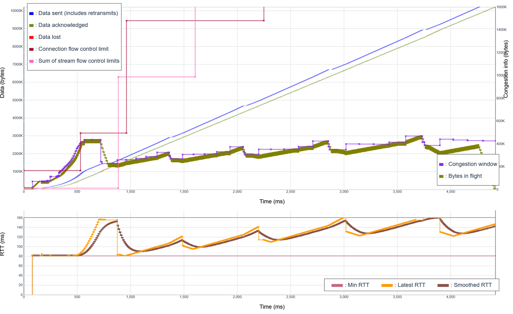
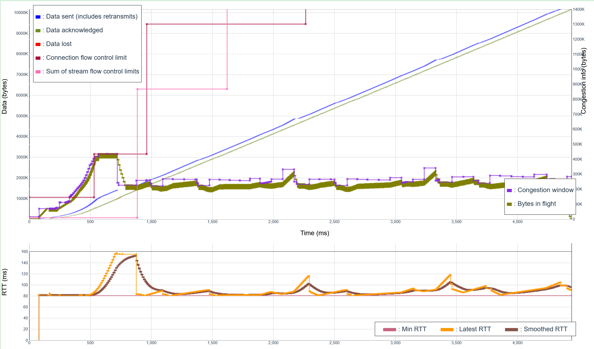
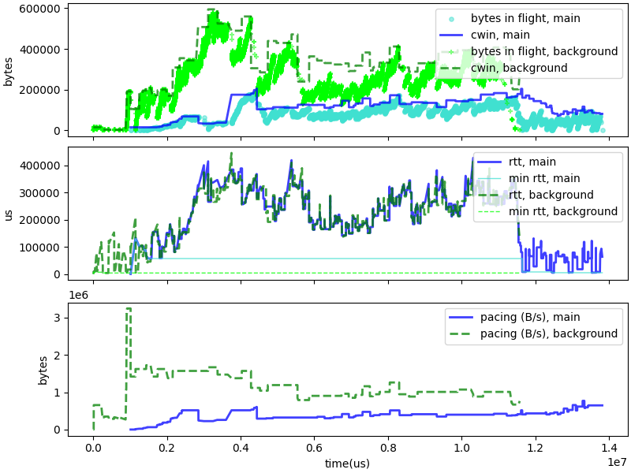
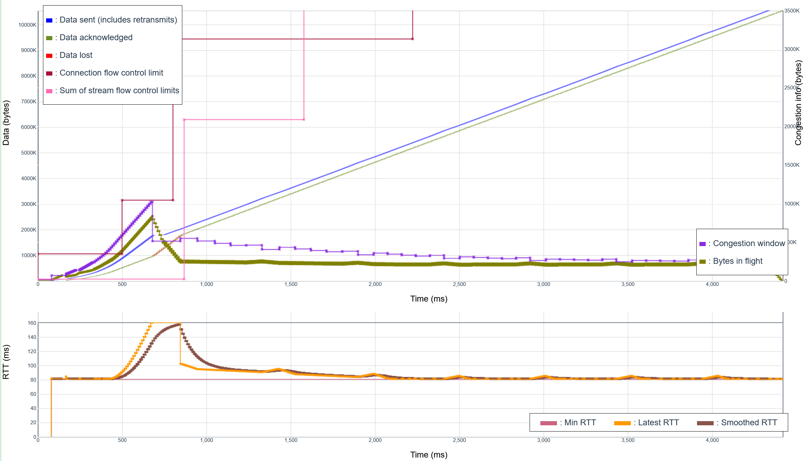

# Refining Time-Based congestion

Our November 2025 design of C4 focused on two big ideas:
monitor the "max RTT", which deals with competition and with Wi-Fi jitters;
and avoid the "delay creep" inherent to loosening the Congestion Window
and the max RTT by pacing transmission at or below the "nominal rate".
Problem is, we were not entirely successful, as shown in the graph
below:

This is an example of the RTT spiraling up. A delay increase is
misinterpreted as coming from external source, the nominal max
RTT increases, the CWND gets larger, and by the next cycle the
RTT increases again. As we can see on the graph, this only stops
when the bottleneck's queue is full, which is a case of bufferbloat.
We have to do better.

## Trying to react and correct

Our first approach was to "react and correct". We tried to detect
occurences of "delay creep". The idea was to find variables
that could be monitored easily and used to detect conditions
like "the pacing rate is too high" before queues become too large,
build excessive delays, or cause packet losses.

The "number of bytes in transit" could be an example of such variable.
In the graph above, we see that number creep up with each cycle
of cruising, pushing and recovery. If we saw continous increase
over a cycle, we could trigger a congestion signal
and reduced the nominal rate by a small amount by 1/32. That worked, "almost".
It fixed the "buffer bloat" issue, as seen in the graph below, but there
were side effects detected on other tests.

Some tests showed that we might have over corrected.
First, the test of "media transmission over bad Wi-Fi" showed a slight
worsening of the average media frame transmission delay.
The test of two connections competing on a bad Wi-Fi channel also
shows slightly degraded results. The graph above points to the reason.
The first connection quickly adapts to the Wi-Fi condition, stamping
out the second connection. 

The chart of bytes in flight shows that
the first connection is building big queues, and that the RTT increase
to 300 to 400ms. This is clearly too much, as we know that the
simulation does not create more than 250ms in jitter. This point to
misinterpreting delays as jitter instead of congestion, and thus a
need to improve the disambiguation test, to distinguish between
"external causes" such  competition or jitter and "internal causes" such
as excessive bandwidth.

We tried, but it didn't work. We instrumented the code to track
many variables, and try to select some that were correlated with our
conditions, but did not find them. We collected lots of simulation
traces covering the span of scenarios in which C4 is expected to
operate, designing the simulations so we could easily detect
the "data rate too large" condition. In the end, the best
observable variables were only weakly correlated with that condition.
Too bad.

## Fixing the bandwidth measurements

The measurement campaign did not succeed in isolating a couple
of neat variables correlated with excess bandwidth, but it brought
an interesting observation. Our data rate assessment code had a
tendency to overestimate the available bandwidth, with errors
of 5% or more being quite common. In our traces, we also
plotted the result of the data rate estimator built in
picoquic and already used in the picoquic implementation
of BBR, and that one appeared much closer to the ground
truth, and actually always lower than the known maximum value.
This pointed to a simple fix: just use the built-in code,
instead of trying to replicate it. And it certainly improved
the result, as seen in this trace of a simple C4 connection:

That worked! Of course, it does not mean that we are finished with
this issue. We still see excessive delays when a C4 flow competes against
another C4 flow, and it would be nice to fix that. Just relying
on the correctness of the rate estimator is a kind of "open loop" control,
and it would also be nice to fix that. But with a good rate estimator, the
results are already pretty good.

 

