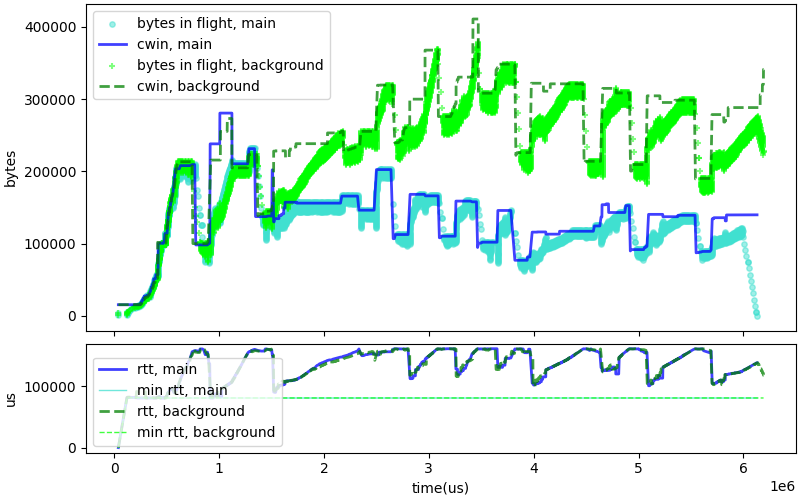
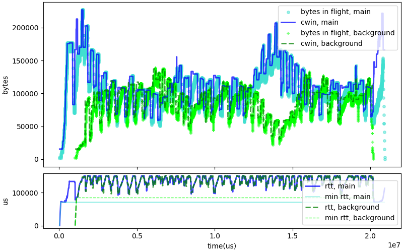
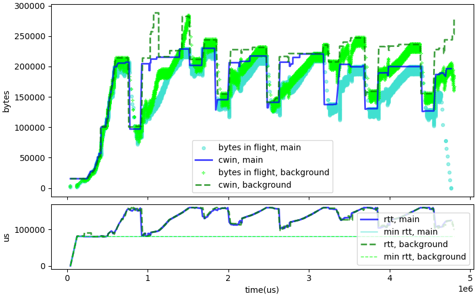
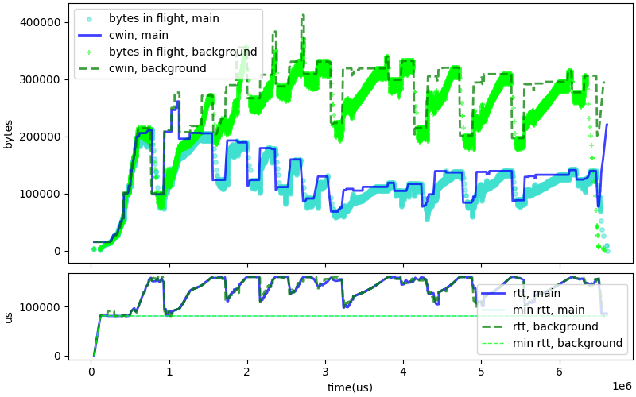

# Removing the RTT filter

The initial code for C4 used an RTT filter initially designed to
protect Cubic connection against spurious exit from HyStart,
due to delay jitter (see
[Implementing Cubic congestion control in Quic](https://www.privateoctopus.com/2019/11/11/implementing-cubic-congestion-control-in-quic/)).
The root cause behind the jitter event turned out to be caused
by Wi-Fi collisions and layer 2 loss repair. We are addressing that
root cause directly, and suspect that at that point the RTT Filter
does not help much and perhaps makes C4 less reactive by introducing
a delay in the processing of RTT samples.

After making this change, we ran all our tests. We expected all of them
to pass. They did, except for one:
~~~
Simulated time 6191862, expected 5750000
10: c4_vs_c4.txt returns -1 after 57 trials.
~~~

When we plot the evolution of CWND and RTT for that failing test, we see that
one of the C4 flows increased its bandwidth and slowed the other down. This
may or may not be due to the removal of the RTT filter. More likely, the
removal of the filter introduced a small change in the flow of a connection,
which triggered an uneven sharing of the bandwidth between the two
competing connections.

In our design, the fairness of bandwidth sharing is enforced by
the "sensitivity" curve, which makes faster flows more reactive to a
congestion signal than slower flows. However, the initial curve was
simplistic: sensitivity zero until a threshold of 50KB/s,
increasing linearly to 1 until a threshold of 1MB/s, flat to 1
after that. With that design, the sensitivity stays flat after
1MB/s.

We hypothesised that making the curve less flat might mitigate
the sharing issue somewhat. We changed the curve to only
reach 94% sensitivity at 1MB/s, and then have it linearly
increase towards 100% between 1MBps and 10MBps. We also
tuned the 'delay threshold' for detecting congestion,
making it shorter for high bandwidth flows. This is
probably somewhat helpful. 

The graph above shows a test in which the 2 C4 flows are expected to
last at least 20 seconds. We still see periods in which one of the
flow is "winning" and at some point using 3 times more bandwidth
than the competitor. This is not good, but we also see that the
situation auto-corrects and that the fair balance is restored
after 2 seconds.

After our change, a typical test shows good sharing between 2 C4 connections,
as shown in the graph above. The test completes in less than 5 seconds.
However, if we repeat the test larger number of times, maybe 500, we are
likely to encounter an outlier, as shown in the graph below.

We probably need more work to improve these competition scenarios and reduce
the risk of outliers. We also observe that even in good cases, we see
some amount of queuing -- the pushback to reduce the big flows occurs
with packet losses, indicating that the path buffers are sometimes full.
We might want for example to not use the full "Max RTT", aim a bit lower,
and drive the delays lower. But this is not much related to the decision
to remove the RTT filter.

At this point, the way forward is probably to:

* Remove the filter to make C4 more responsive to RTT
* Increase the target duration for the C4 vs C4 test to 6.25sec to
  reduce the risk of failing the test because of an outlier.
* Wait for a separate PR to improve fairness.
