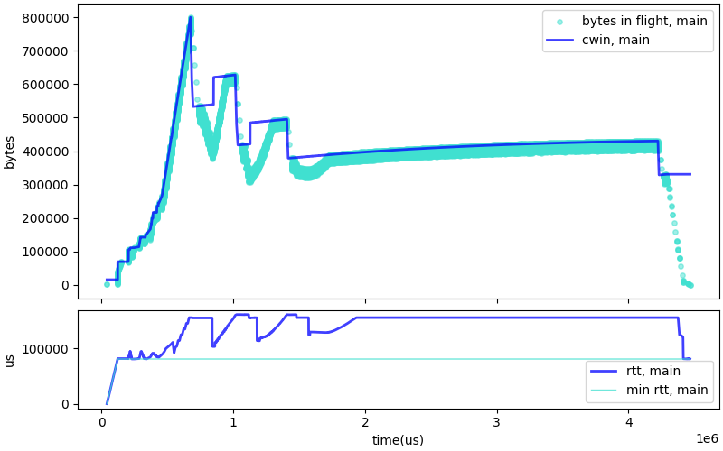
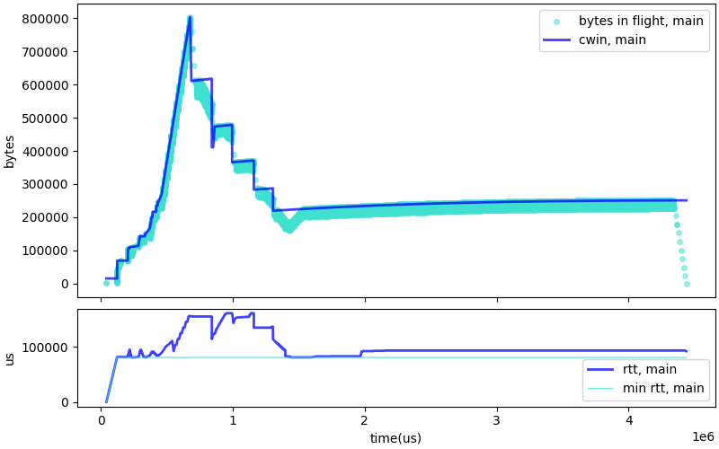
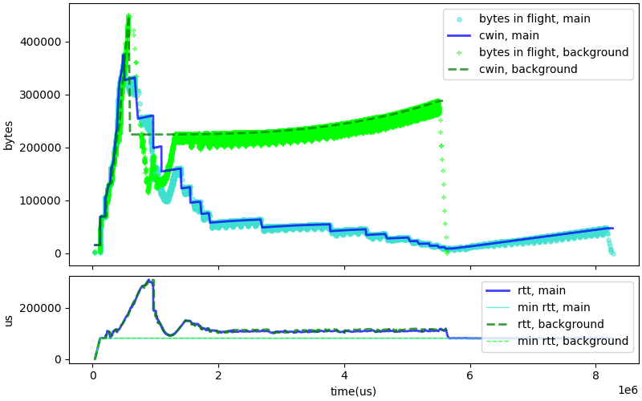

# Delay based congestion control algorithms are too polite

Classic congestion control algorithms like Cubic attempt to maximize the
throughput of the connection. This leads to the behavior shown in figure 1:

We see the connection starting with a "slow start" phase, during which it tries to
rapidly increase the congestion window (Cwnd) until it detects either that delays are increasing too
much or that packets are being lost. After that, Cubic moves to a "congestion avoidance"
phase, during which Cwnd grows slowly according to the Cubic formula, then is rolled
back if packet losses are detected, i.e., when the network queues are full. Because of that,
Cubic tends to fill the queues, and applications experience a lot of latency.

We can design algorithms that also back off when they detect increasing delays.
That was the idea behind
[TCP Vegas](https://sites.cs.ucsb.edu/~almeroth/classes/F05.276/papers/vegas.pdf).
We follow the TCP Vegas lead and developing a modified version of Cubic that
behaves "like TCP Vegas" -- we call it DCubic. In contrast with Cubic,
DCubic will also back off if it sees the delays
increase during the congestion pahse. We can see the effects on this simple graph
that shows the evolution
of Cwnd and RTT over the course of the connection, figure 2:

We see some queue build up during the initial slow start phase, but after that the
delays stabilizes and the latency aligns closely with the minimum RTT of the connection.
That seems like a good fit for real time connections, but there is a catch. Backing
off on delay increase is a polite behavior. When competing with a not-so-polite
algorithm like Cubic, the polite algorithm looses, as shown on figure 3:

During the initial startup phase, DCubic and Cubic discover about the same Cwnd. But
after that, Cubic builds queues. DCubic reacts to the long queuing delays and
backs off gradually, eventually yielding most of the network capacity to the
Cubic connection. That's the main reason why algorithms like DCubic or
TCP Vegas can only be deployed "in controlled environments".

The competition issue may be solved if the network deploys active queue management
algorithms that either provide enough feedback to cause classic algorithms like
Cubic to back off, or maybe implement fair queuing and enforce a reasonable
sharing of the resource. That would be nice, but such deployments are likely
to take some time. In between, if we want to deploy "delay sensitive" algorithms,
we have to ensure that they are not juststarved by competing connections.