# Handling of competition with Wi-Fi jitter

In some Wi-Fi networks, radio interferences and the "hidden receiver" problem causes collisions,
which generate large delay jitter. C4 copes with that by detecting the "chaotic jitter"
situation, and targeting a higher delay than the min RTT. This works reasonably
when the C4 connection is the sole user of the WiFi link, but if there are
multiple competing connections we may have a problem.

# Evaluation of competition under Wi-Fi jitter

Following the evaluation of the pig-war detection (see ./pig-war-detection.md),
we suspected that evaluation in presence of delay jitter might show a different
behavior, and we added a series of competition test under harsh jitter conditions:
c4 vs cubic, c4 vs bbr, and c4 vs c4. In all these tests, the C4 connection
starts one second after the beginning of the competing connection.

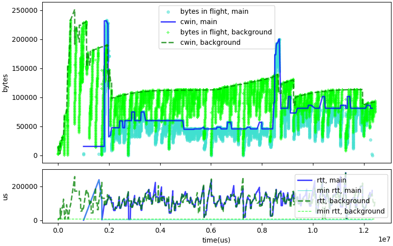

The first graph shows a trace of RTT and CWND in the C4 versus Cubic scenario.
There is an unexpected behavior at the beginning of the connection: we usually
see an initial spike in the CWND caused by the exponential growth during the
initial phase, but it does not happen here. We have to wait 7 seconds to see the
C4 CWND almost matching the Cubic value. On the other hand, after that,
C4 and Cubic progress at similar rate. The overal duration of the test is less
than twice the duration in the absence of competition, and thus could be
acceptable if not ideal.

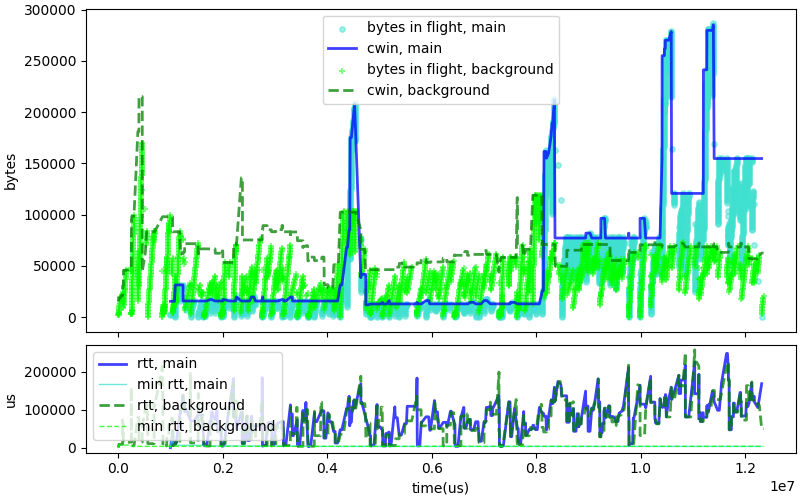

The second graph shows the behavior of C4 against BBR in the same conditions.
We can make the same observation about the lack of initial spike. We see a
first spike 4.5 second after the beginning of the test, probably triggered
by the "slowdown" test. The CWND returns to a low value, but the MAX CWND
has been set to a high value, leading to a "pig war" detection 8 seconds into
the test. After that, C4 sends at a higher rate than BBR, and the test
completes in less than twice the duration in the absence of competition.
Again, this is almost acceptable, although very messy.

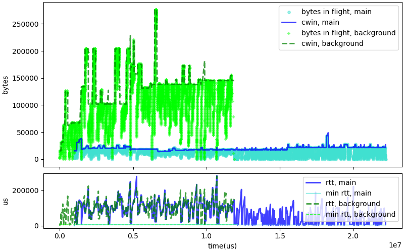

If the tests of C4 versus Cubic and C4 versus BBR could be classified
as merely not very good, the test of C4 versus C4 is unequivocally bad.
The background C4 connection completely dominates the beginning of the
test. It reacts to the arrival of the competing connection by going into
pig-war mode, and dominating even more until the scheduled transfer
is complete. The main C4 connection gets stuck using a low CWND value,
even when the background connection closes. The test duration is
almost 4 times the the duration in the absence of competition.

# Delay based congestion and exit initial

C4 will exit the initial startup if congestion is detected, including
initial congestion. This is one of 4 possible exit causes, with ECN-CE marks,
packet loss, or absence of CWND increase for 3 RTT. We ran a couple
of simulations, but while logical this test is not too convincing.

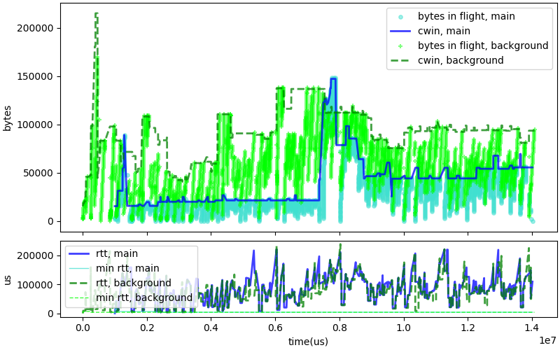

In the case of C4 versus BBR, the worst case scenarios seems worst. When we
repeated this test 100 times with the "v1" software, the worst case test
lasted 13 seconds. With the modification, the worst case lasts more than 14.
The modification did cause the expected spike in CWND at the beginning of the
C4 connection, the resulting CWND was a bit larger, but this delayed
the detection of "pig war", resulting in the overal longer duration.

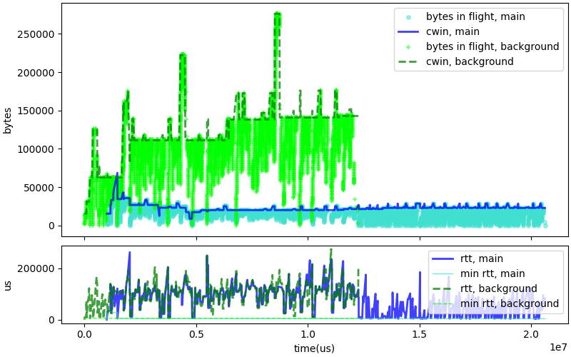

The test against C4 was similarly unconclusive, probably because it made
both the main and the background connections more aggressive.

The easy solution of tweaking the initial startup was tempting, but
it does not solve the problem. In fact, it makes it worse.

# Revisiting the C4 behavior under competition

Per initial design, C4 only uses a single control variable, the "nominal
CWND". C4 does set a pacing rate, but this set to "CWND / RTT". It is used to
smooth traffic and avoid sending all the data in a big batch, while
not slowing transmission. we may need to revisit that.

BBR seems to handle the competition scenarios better than C4,
because it sets the pacing rate to the maximum data rate measured
for the path, and CWND to twice the BDP. BBR will thus fully
utilize the link as long as actual delay is not more than twice
the min delay. Pacing at the bottleneck rate also ensures that
no queue is built, even if the CWND is much larger than the BDP.

The "nominal CWND" that we are using in the first version of C4
is tightly linked to a rate estimate. The "nominal CWND"
is computed as the maximum value of the "corrected delivered bytes" between
congestion events:
~~~
corrected_delivered_bytes = delivered_bytes * min_RTT / current_RTT
~~~
This could also be written as:
~~~
rate_estimate = delivered_bytes / current_RTT
corrected_delivered_bytes = rate_estimate * min_RTT
~~~

After any modification of the min RTT or the nominal CWND, or after a
change of state, C4 sets the `path_x->cwin` variable and calls the
picoquic API `picoquic_update_pacing_data`, which will compute
new pacing parameters, which are more or less:

~~~
pacing_rate = CWND / smoothed_RTT
if state == initial:
    pacing_rate *= 1.25
quantum = min(CWND/4, 0x10000)
~~~

We could modify that logic to take into account the "nominal rate"
as well as the "nominal_cwnd":

~~~
pacing_rate = nominal_rate*alpha
if state == initial:
    pacing_rate *= 1.25
if chaotic_jitter or pig_war:
    CWND = high_CWND*alpha
else:
    CWND = nominal_cwnd*alpha
quantum = min(CWND/4, 0x10000)
~~~

We would also need to revise the congestion control logic, to
reduce not just the nominal CWND but also the nominal rate
and the high CWND in case of congestion.

These changes are straightforward, but drastic. In a first phase,
we focused on just the "chaotic jitter" case, as follow:

- Monitor nominal CWND, nominal rate and high CWND
- Use the existing logic during "initial" phase, and then as long
  as the chaotic jitter condition is not detected.
- Use the high CWND and the rate control if chaotic jitter
  is detected.

The changes do improve the behavior in the "bad wifi" tests.

# Improved results after change

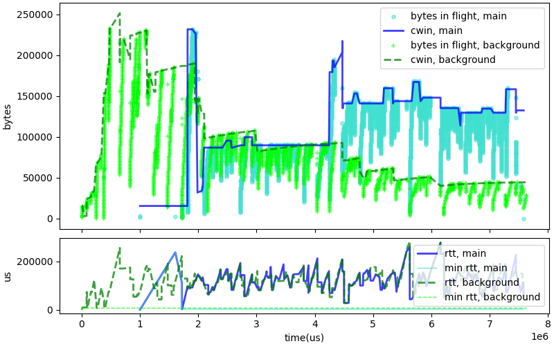

The first graph shows a trace of RTT and CWND in the C4 versus Cubic scenario,
after our modification. The main change is that C4 is much more aggressive, so
the scenario completes faster. We see in fact three regions in the graph: C4 starts
slowly, then move to "chaotic" mode and competes fairly with Cubic, then probably
goes to an "initial" phase again, and gets a much larger share of the network than Cubic. 

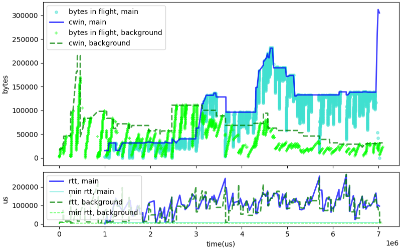

The second graph shows the behavior of C4 against BBR after our modifications.
The interesting and perhaps worrying part is that C4 ends up dominating BBR.
Again, this is a sign that we are perhaps too aggressive.

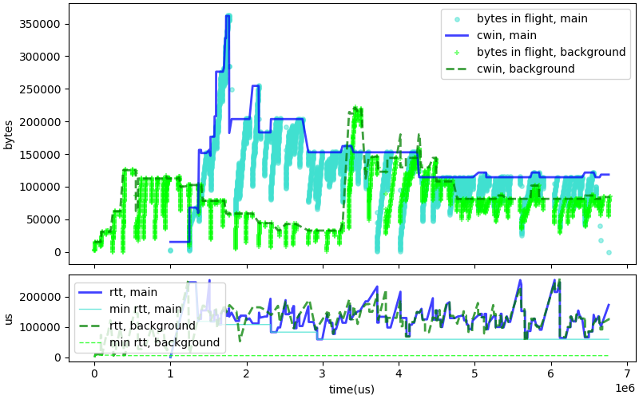

We see a steep initial climb after the "main" C4 starts, as it probably benefits
from the "latecomer advantage". The background connection goes in "initial" mode after
a couple of seconds, after which the two connections share the resource reasonably,
if not quite evenly.

# A little bit less agressive

These experiments seem to validate our approach, but there are a few issues.
The obvious one is that
C4 seems to be a bit too aggressive. We may want to tune that down a little.
Instead of setting the CWND to the high CWND value, it seems better to
use a compromise: in case of high jitter, increase the CWND by half the
difference between the hign and the nominal values. This has two main
advantages:

- In most cases, the CWND will be lower than the high value, and thus
  not likely to overfill the path's buffers and cause packet drops.
- The value of the CWND will increase by 20% of the nominal value
  in the pushing stages, which should be enough to cause a small amount
  of disorder and test increases in capacity.

Indeed, doing so appears to tame the C4 behavior a bit, while still
keeping it aggressive enough to obtain a reasonable share of the bandwidth.

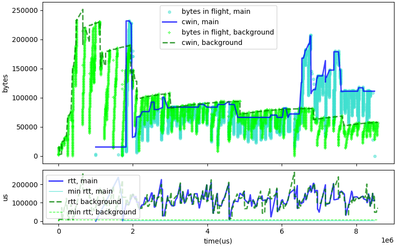

The behavior when competing with Cubic retains most of the characteristics
of the "full Big CWND" behavior seen before but converges on a slightly lower
share of the bandwidth, as we expected.

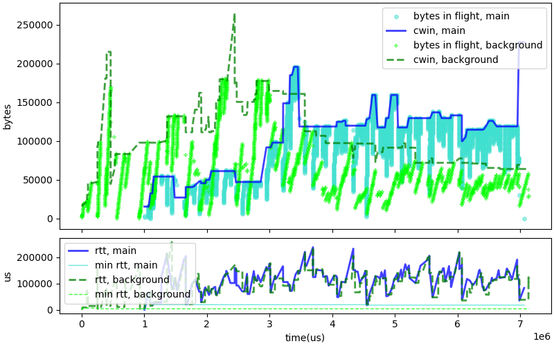

The graph of the competition between this version of C4 and BBR also shows
improved fairness compared to the previous one, with BBR maintaining
a better share of the bandwidth than before.

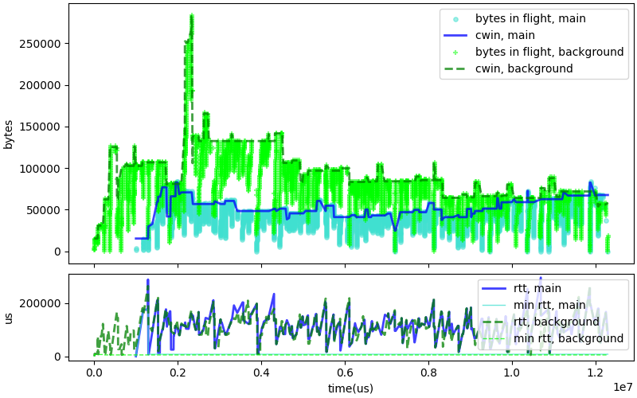

The graph of the competition between C4 and C4 with the less aggressive code
also shows what we consider an improvement, with the two connections converging to
about half of the bandwidth.

We will still need to investigate some details of the behavior.
We sometimes see very brief spikes of bandwidth usage, characterized in the graph
by narrow bands in which C4 uses a much higher CWND and having then to rapidly reduce
it -- we see that for example at about 2 seconds since the start of the Cubic vs C4
test. This does not look quite right. We will have to study that in a follow-up
investigation.