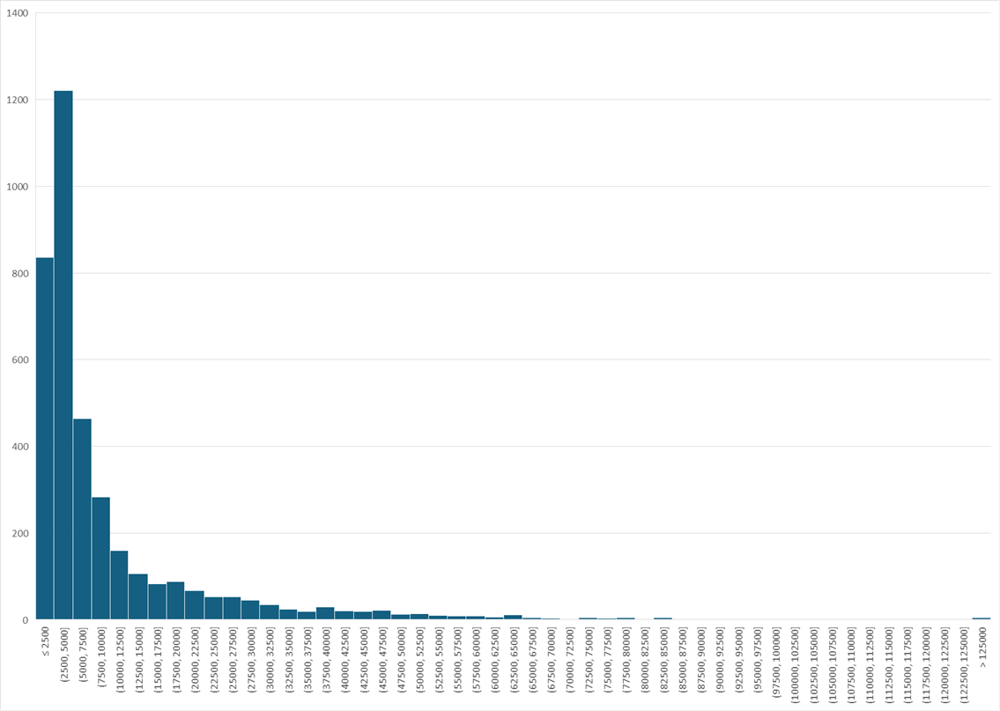
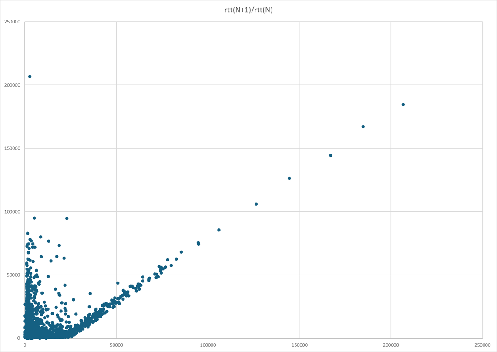
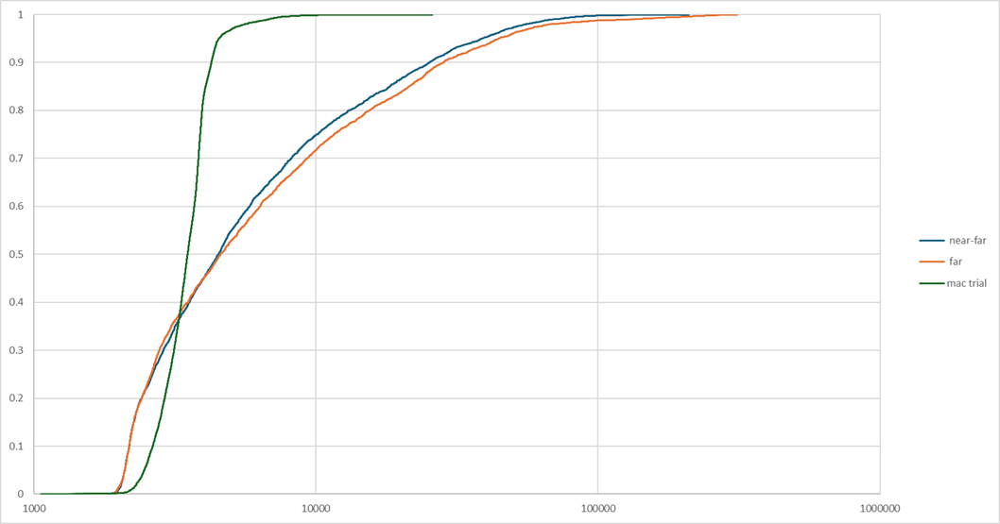
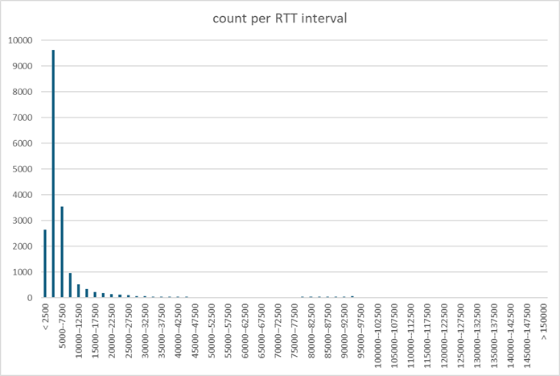
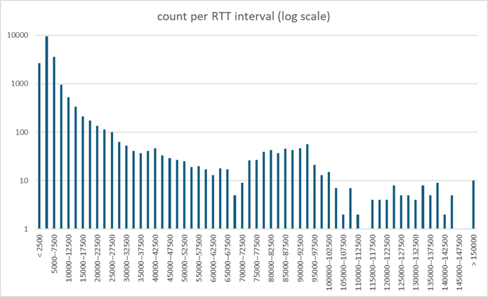
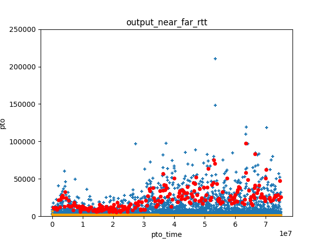

# Wi-Fi Jitter

We noticed the "Wi-Fi jitter" issue two years ago
(see [the weird case of Wi-Fi latency spikes](https://www.privateoctopus.com/2023/05/18/the-weird-case-of-wifi-latency-spikes.html)).
We would see sudden jumps in measured RTT, from 1 or 2 milliseconds to 50 tor even 200ms.
Since that, we have been looking for explanations of these observation.
Our early hypotheses were that the whole Wi-Fi operation was "suspended"
for short intervals, either to allow the Wi-Fi device to explore alternative
radio frequencies, or perhaps to comply with regulations requiring that
Wi-Fi yields to higher priority radio applications like radars at airports.
Analyzing more recent traces allowed us to make progress, and explain
the phenomenon without the "suspension" hypothesis.

The graph above shows the evolution of RTT over a 75 second Wi-Fi connection.
It was captured using an ad hoc tool,
[octoping](https://github.com/private-octopus/octoping),
that sent udp packets from a client to a responder and recorded the time
at which an echo of these packets arrived. The session starts at a point where the
transmission conditions are relatively good, before the device moves to a location
where Wi-Fi conditions are very degraded and cause numerous delay spikes.

The histogram shows that most measured RTT are small, but that the distribution of RTT has a very long tail,
and some kind of exponential distribution. 

Looking further, we plotted the observed RTT as a function of the next RTT. That graph has a very distinctive shape,
and a very interesting feature, with lots of high value samples clustered around a parallel to the diagonal that crosses
the x-axis near the 20 millisecond mark. The rightmost points on that line are spaced 20ms apart. We know that
the octoping program sent packets at 20ms intervals. What we see here is a consequence of in order delivery.
If the first packet encountered a long RTT, the packet after that, sent 20ms after it, arrives at almost the
same time, as if it was retained by some Wi-Fi component until it could be delivered in sequence.

Of course, we don't want to draw conclusions from just one sample. We have collected multiple such samples, and we do see
variations between them, such as the difference showing between in cumulative frequency distributions of observed RTT in
three different trials. One of this trials was done in good conditions, and it markedly differs from the other two, with
the  CFD showing most values clustered around the median. The other two are similar, with a much wider distribution
of observed RTT, one being somewhat worse than the other.

To try get a better understanding, we took all the samples. We filtered out values that only differed from the previous observation
by the interval between two probes, because in those cases the delays result from in sequence delivery rather that a random
process. Then we draw the histogram of all observed values... and it does not tell us much. The leftmost part of the histogram
looks like some kind of Gaussian or Poisson process, but the tail is a bit large.

The graph that we found most informative takes the same RTT values per interval, and plots then in a log scale. We seem to
have a complex process, combining a short term random process of some sort, and a secondary process that produces very large
values, albeit at a low frequency.

We don't really know what caused this, but we can think of two Wi-Fi processes, both figuring exponential backoff.
The CDMA process enables multiple stations managed by different access points to share the same channel. In
case of collision, they will retry at a random time picked in an interval that doubles after each collision.
The CDMA collisions are generally resolved in a few milliseconds. We believe that CDMA collisions
explain the left most part of the curve.

The "bumps" in the right side of the curve have to be explained by a different process that also involves
exponential backoff and probably operates with a granularity measured in tens of milliseconds.
This could well be due to the "frame restransmission" process that Wi-Fi device uses for the "best effort"
channel. If the packet is lost, it is resent after an interval. In case of repeated losses, the
repeat interval increases exponentially.

This packet repeat process is not present all the time -- for example, we do not see it in the "good" trial
in our graph of CFD in three different trials. We see it a lot in the "bad" samples. They were captured
in a multi-appartment building. It is very likely that multiple Wi-Fi access points were operating in
that building, causing some packet collisions due to the "hidden terminal" problem.

Whatever the actual cause, we do observe some pretty extreme values of RTT jitter in some Wi-Fi
networks. Our first observation is that this jitter is not properly modelled by the algorithm in TCP
or QUIC. For example, for QUIC, the algorithm defined in [RFC 9002](https://www.rfc-editor.org/rfc/rfc9002.html)
compute a "smoothed RTT" by performing a exponential smoothing of RTT samples, and a "PTO" timer
as the sum of the smoothed RTT and four times the estimated "RTT variance". We programmed these formulas,
and computed the PTO timer for the various traces that we collected. This timer will "fire" when the
next acknowledgment does not arrive before its expiration. In the graph, we show the effect
for our "near far" trial. Each blue "+" sign correspond to one RTT sample. Each red dot correspond to
a firing of the PTO timer. That's a lot of firings!

In practice, the first effect of these spurious PTO timers will be to mislead the "delay based" algorithms
such as Hystart, causing an early exit of the "slow start" phase that is hard for algorithms like Cubic
to compensate. We first noticed this problem in 2019 when testing Cubic for QUIC (see 
[Implementing Cubic congestion control in Quic](https://privateoctopus.com/2019/11/11/implementing-cubic-congestion-control-in-quic/)).
It is interesting that this blog includes a graph of observed delays very similar to the
WiFi trials discussed here, although at the time we focused mostly on the short-scale
variations. The low-pass filtering recommended in this blog does solve the short-scale
issue, but is defeated by the arrival of very large RTT. After our tests, we fixed
our implementation of Cubic to return to slow start if the exit of Hystart was causes
by a spurious timer, and that markedly improved the robustness of Cubic.

The second effect is to create large gaps in received packets. Supposed that a packet is
delivered with a long latency. All packets sent after it will be queued, and example of
"head of line" blocking. This will be perceived by the endpoint as a "suspension",
as we diagnosed in 2023. These gaps will have different effects on
different congestion control algorithms. These effects need to be studied. We have
thus developed an way to simulate these latencies, so that we can
perform tests and simulations of algorithms operating in different Wi-Fi conditions.

We are still not quite sure of the processes causing this latency, but
this should not prevent us from doing an useful model that more or less mimics the
latency variations of Wi-Fi networks. After all, the models used by Hellenistic
astronomers to predict the movement of planets where not exactly based on
the formulas later refined by Kepler and then Newton, but their complex
combinations of epicycloids was precise enough to build devices like
the Antikythera mechanism and help ancient mariners navigate.

In our model, we define the latency by combining several generators, combined using 
a coefficient x defining how of a secondary long scale repetition is also used:

* A Poisson arrival model with lambda=1 providing the number N1 of short scale 1ms intervals,
* A random value r between 0 and 1 ms
* For a fraction (1-x) of the packets, we set the number N2 to 0.
* For a fraction (x) of the packets, we compute N2 from a Poisson arrival model with lambda = 12,
  and an interval length of 7.5ms.

The latency for a single sample will be:
~~~
latency = N1*1ms + N2*7.5ms
if N1 >= 1:
    latency -= r
~~~
The coefficient x is derived from the target average jitter value. If the target is
1ms or less, we set x to zero. If it is higher than 91ms, we set x to 1. If
it is in between, we set:
~~~
x = (average_jitter - 1ms)/90ms
~~~
We have been using this simulation of jitter to test our implementation of multiple
congestion control algorithms.

